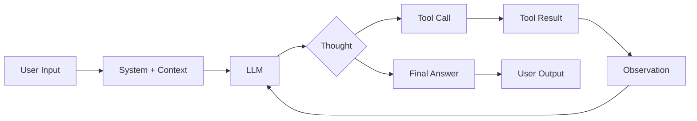
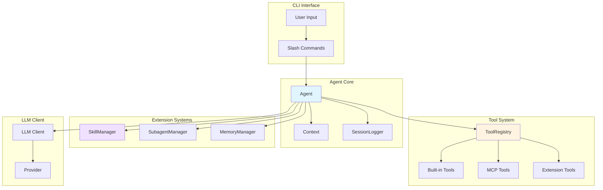
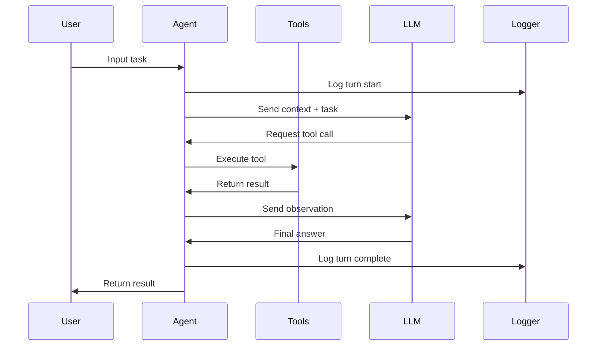

# BabyClaw

<p align="center">
  
</p>

BabyClaw is a professional-grade AI coding agent that operates directly in your repository, combining an OpenAI-compatible LLM client with local tools, slash commands, skills, MCP integrations, delegated subagents, and comprehensive session logging. Built for real development work rather than chat demos, BabyClaw enables file inspection, code editing, command execution, and long-running sessions with context compaction.

## Table of Contents

- [Why BabyClaw](#why-babyclaw)
- [Key Features](#key-features)
- [Architecture](#architecture)
- [Quick Start](#quick-start)
- [Configuration](#configuration)
- [Usage](#usage)
- [Session Management](#session-management)
- [Extension System](#extension-system)
- [Documentation](#documentation)
- [Development](#development)
- [License](#license)

## Why BabyClaw

BabyClaw is built on a philosophy of **terminal-first development** with these core principles:

### Work Where Your Code Is
- Operate directly in your repository from the shell
- No web UI required (though optional HTTP mode is available)
- Full access to your files, commands, and development environment
- Session logs stored alongside your code or in your home directory

### Observable and Auditable
- Live activity feed shows exactly what the agent is doing
- Structured per-session logging with full execution traces
- Nested logs for delegated subagent tasks
- Human-readable LLM logs and machine-readable event streams

### Extensible Without Bloat
- Local skills system for domain-specific expertise
- MCP (Model Context Protocol) integrations for external tools
- Runtime extensions that load without restart
- Slash commands for workflow control
- No hardcoded domain logic in the core agent

### Built for Long Sessions
- Context compaction keeps long-running sessions usable
- Manual and automatic compaction strategies
- Memory policies with structured handoff
- Token usage tracking and budget estimation

### Parallel Task Delegation
- Subagents for isolated parallel work
- Fresh contexts prevent pollution
- Bounded concurrency prevents resource exhaustion
- Nested session logs for complete traceability

## Key Features

### Core Capabilities

**Repository Tools**
- `read_file` - Inspect file contents with precise line ranges
- `write_file` - Create or modify files with atomic writes
- `run_command` - Execute shell commands with timeout control
- `find_capabilities` - Discover available tools, skills, and extensions
- `request_capability` - Record missing capabilities for session resolution

**Self-Extension**
- `load_skill` - Load domain expertise from skill bundles
- `run_subagent` - Delegate isolated tasks to child agents
- `refresh_runtime_capabilities` - Reload tools and extensions

**Web Integration** (when enabled)
- `fetch_url` - Fetch content from public URLs
- `read_webpage` - Read and parse web pages
- `extract_page_links` - Discover links from web pages

**macOS Integration** (when enabled)
- `finder_action` - Interact with Finder
- `calendar_action` - Manage Calendar.app events
- `notes_action` - Create and search Notes
- `reminders_action` - Manage reminders
- `messages_action` - Read recent messages

### Workflow Features

- **Slash Commands** - Control agent behavior and inspect state
- **Skills System** - Load domain expertise on demand
- **MCP Support** - Integrate external tool servers
- **Subagents** - Parallel task delegation with isolation
- **Context Compaction** - Keep long sessions within token limits
- **Planning Mode** - Draft and apply structured plans
- **Session Logging** - Complete execution traces per session
- **HTTP Mode** - Optional browser-based interface

## Architecture

### ReAct Loop

BabyClaw implements a **ReAct (Reasoning + Acting)** loop that alternates between:

1. **Thought**: The LLM reasons about the current state and next action
2. **Action**: The LLM selects and invokes tools
3. **Observation**: Tool results are fed back to the LLM
4. **Iteration**: The loop continues until the task is complete



### Component Architecture



### Session Lifecycle



## Quick Start

### Installation

```bash
# Clone the repository
git clone https://github.com/yourusername/babyclaw.git
cd babyclaw

# Create virtual environment
python -m venv .venv
source .venv/bin/activate  # On Windows: .venv\Scripts\activate

# Install dependencies
pip install -r requirements.txt

# Optional: Install dev dependencies for testing
pip install -r requirements-dev.txt

# Configure git hooks for secret detection
git config core.hooksPath .githooks
```

### Configuration

Create your configuration files:

```bash
# Copy example configurations
cp config.yaml.example config.yaml
cp .env.example .env
```

**Minimal `config.yaml` for OpenAI-compatible APIs:**

```yaml
llm:
  provider: custom
  model: your-model-name
  base_url: https://api.example.com/v1
  api_key: your-api-key

agent:
  max_iterations: 10

ui:
  enable_streaming: true

logging:
  enabled: true
```

**Using environment variables** (overrides `config.yaml`):

```bash
export LLM_PROVIDER=custom
export LLM_MODEL=your-model-name
export LLM_BASE_URL=https://api.example.com/v1
export LLM_API_KEY=your-api-key
```

**Provider examples:**

```yaml
# OpenAI
llm:
  provider: openai
  model: gpt-4
  api_key: ${OPENAI_API_KEY}  # From environment

# Azure OpenAI
llm:
  provider: azure
  model: gpt-4
  api_key: ${AZURE_API_KEY}
  api_base: https://your-resource.openai.azure.com
  api_version: 2023-05-15

# Ollama (local)
llm:
  provider: ollama
  model: codellama
  base_url: http://localhost:11434
```

### Running BabyClaw

**CLI Mode:**
```bash
python -m src.main
```

**HTTP Server Mode:**
```bash
python -m src.main serve
```

HTTP mode provides:
- Chat UI: `http://127.0.0.1:8765/`
- Admin Console: `http://127.0.0.1:8765/admin`
- Health Check: `http://127.0.0.1:8765/api/v1/health`

**Note:** HTTP mode has no authentication in v1 and is designed for local use only.

## Configuration

### Configuration Priority

Configuration is loaded in this order (later sources override earlier ones):

1. `config.yaml` - Base configuration
2. `.env` - Secrets and machine-specific values
3. Environment variables - Runtime overrides

### Key Configuration Sections

Common dotted-path toggles:
- `logging.async_mode` controls background log writes.
- `macos_tools.enabled` turns the macOS helper tool family on or off.
- `web_tools.enabled` controls the built-in public web reader tools.
- `extensions.enabled` controls runtime extension discovery and loading.

#### LLM Configuration

```yaml
llm:
  provider: custom          # openai, azure, ollama, custom
  model: gpt-4
  base_url: https://api.openai.com/v1
  api_key: ${OPENAI_API_KEY}
  temperature: 0.0
  max_tokens: 4096
```

#### Agent Behavior

```yaml
agent:
  max_iterations: 10        # Maximum ReAct loop iterations
  timeout_seconds: 120      # Per-iteration timeout
```

#### UI Settings

```yaml
ui:
  enable_streaming: true    # Show live activity feed
  show_thinking: true       # Display internal reasoning
```

#### Server Settings

```yaml
server:
  host: 127.0.0.1           # Bind address (HTTP mode)
  port: 8765                # Port (HTTP mode)
  db_path: ~/.babyclaw/state.db  # SQLite database path
```

#### Logging

```yaml
logging:
  enabled: true
  async_mode: true          # Background log writes
  log_dir: ~/.babyclaw/sessions  # Session log directory
```

#### Subagents

```yaml
subagents:
  enabled: true
  max_parallel: 3           # Concurrent child agents
  max_per_turn: 6           # Max per parent turn
  default_timeout_seconds: 180
```

#### Context Compaction

```yaml
context:
  auto_compact:
    enabled: true
    target_ratio: 0.8       # Compact at 80% of context window
    min Turns_to_keep: 3    # Keep recent turns in raw form
```

#### macOS Tools

```yaml
macos_tools:
  enabled: true
  timeout_seconds: 10
  enable_finder: true
  enable_calendar: true
  enable_notes: true
  enable_reminders: true
  enable_messages: true
```

#### Web Tools

```yaml
web_tools:
  enabled: true
  timeout_seconds: 15
  max_response_bytes: 2000000
  max_content_chars: 20000
  allow_private_networks: false  # Only public HTTP/HTTPS
  enable_fetch_url: true
  enable_read_webpage: true
  enable_extract_page_links: true
```

#### Extensions

```yaml
extensions:
  enabled: true
  user_root: ~/.babyclaw/extensions
  repo_root: .babyclaw/extensions
  runner_timeout_seconds: 60
  install_timeout_seconds: 30
  catalogs: []  # Remote extension catalogs
```

#### MCP Integration

```yaml
mcp:
  servers:
    - name: deepwiki
      url: https://mcp.deepwiki.com/mcp
      enabled: true
      timeout: 30
```

### Environment Variables

Commonly used environment variables:

```bash
# LLM Configuration
LLM_PROVIDER=openai
LLM_MODEL=gpt-4
LLM_API_KEY=sk-...

# Server
SERVER_HOST=127.0.0.1
SERVER_PORT=8765

# Subagents
SUBAGENTS_ENABLED=true
SUBAGENTS_MAX_PARALLEL=3
SUBAGENTS_MAX_PER_TURN=6

# Logging
LOGGING_ENABLED=true
LOGGING_ASYNC_MODE=true
LOGGING_LOG_DIR=~/.babyclaw/sessions
```

## Usage

### Basic Interaction

```bash
$ babyclaw

You > Read the README file and summarize it

Agent >
  • LLM call 1 requested 1 tool
  • Tool finished: read_file(file_path='README.md') (0.02s)
  • LLM call 2 produced final answer

This project is a terminal-first AI coding agent...
[Full summary]

1234 prompt tokens • 234 completion tokens • 1.23s • TTFT 0.45s • gpt-4 (openai)
```

### Slash Commands

Control agent behavior with slash commands:

**Help and Information**
- `/help` - List all available commands
- `/tool` - Inspect available tools
- `/skill` - List, pin, and manage skills
- `/mcp` - Inspect MCP servers and tools
- `/context` - Show context usage and token estimates
- `/subagent` - Inspect subagent runs

**Skills Management**
- `/skill` - List all discovered skills
- `/skill use <name>` - Pin a skill for the session
- `/skill clear <name|all>` - Unpin skills
- `/skill show <name>` - Inspect a skill
- `/skill reload` - Rescan skill directories

**Capabilities and Extensions**
- `/capability` - Manage missing capability requests
- `/runtime reload` - Reload tools and extensions

**Planning**
- `/plan` - Enter planning mode
- `/plan apply` - Apply current plan

**Context Management**
- `/context` - Show detailed context usage
- `/compact` - Trigger context compaction
- `/memory` - Manage session memory

### Using Skills

Skills are domain-specific knowledge bundles that can be loaded on demand:

**Explicit Mention:**
```bash
You > $pdf extract tables from report.pdf
```

**Pinned Skills:**
```bash
You > /skill use pdf
Pinned skill: pdf

You > Extract tables from report.pdf
# PDF skill is automatically loaded
```

**Skill Discovery:**
```bash
You > /skill

Available Skills (5)
┏━━━━━━━━━━━━━━━━━━━━━━┳━━━━━━━━━━━━━━━━━━━━━━━━━━━━━━━━━┳━━━━━━━━━━┓
┃ Skill                ┃ Description                     ┃ Source   ┃
┡━━━━━━━━━━━━━━━━━━━━━━╇━━━━━━━━━━━━━━━━━━━━━━━━━━━━━━━━━╇━━━━━━━━━━┩
│ pdf                  │ PDF workflows                   │ repo     │
│ terraform            │ Infrastructure as Code         │ user     │
│ kubernetes           │ Kubernetes deployments          │ repo     │
...
```

### Subagents

Delegate isolated tasks to child agents:

```bash
You > Analyze the authentication system and database layer in parallel

Agent >
  • LLM call 1 requested 1 tool
  • Tool finished: run_subagent(2 requests) (15.3s)
    ├─ subagent-001: auth-analysis completed (7.2s)
    └─ subagent-002: db-analysis completed (8.1s)
  • LLM call 2 produced final answer

Authentication analysis: [...]
Database analysis: [...]
```

### Context Management

Monitor and manage your session context:

```bash
You > /context

Context Usage
━━━━━━━━━━━━━━━━━━━━━━━━━━━━━━━━━━━━━━━━━━━━━━━━━━━━━
System Prompt:     1,234 tokens
History:          12,456 tokens
Skills:             1,890 tokens
─────────────────────────────────────────────────────
Estimated Total:  15,580 tokens
─────────────────────────────────────────────────────
Context Window:   128,000 tokens
Usage:             12.2%

Recent Turns (5)
┏━━━┳━━━━━━━━━━━━━━━━━━━━━━━━━━━━┳━━━━━━━━━┓
┃ # ┃ Type                       ┃ Tokens  ┃
┡━━━╇━━━━━━━━━━━━━━━━━━━━━━━━━━━━╇━━━━━━━━━┩
│ 1 │ user                       │ 234     │
│ 2 │ assistant (2 tools)        │ 1,567   │
...
```

## Session Management

### Session Logging

Every CLI or HTTP session creates a comprehensive log directory:

```
~/.babyclaw/sessions/
  latest-session -> 2026-03-09-task-sess_abc123def456/
  2026-03-09-task-sess_abc123def456/
    session.json              # Session metadata
    llm.log                   # Human-readable execution timeline
    events.jsonl              # Structured event stream
    artifacts/                # Large payloads
    MEMORY.md                 # Curated session memory
    daily/                    # Append-only daily notes
    memory-settings.json      # Memory policies
    memory-audit.jsonl        # Memory operations log
    subagents/                # Child agent sessions
      subagent-research-001-sa_0001/
        session.json
        llm.log
        events.jsonl
```

### Log Files

**session.json**
```json
{
  "session_id": "sess_abc123def456",
  "session_kind": "main",
  "start_time": "2026-03-09T10:30:00Z",
  "end_time": "2026-03-09T10:35:23Z",
  "status": "completed",
  "cwd": "/path/to/repo",
  "llm_call_count": 12,
  "tool_call_count": 23,
  "total_duration_seconds": 323.5,
  "provider": "openai",
  "model": "gpt-4"
}
```

**llm.log** - Human-readable trace:
```
[2026-03-09 10:30:01] Turn 1 started
[2026-03-09 10:30:01] LLM call 1: 1234 prompt tokens, 0 completion tokens
[2026-03-09 10:30:02] Tool requested: read_file(file_path='README.md')
[2026-03-09 10:30:02] Tool finished: read_file (0.02s)
[2026-03-09 10:30:03] LLM call 2: 1456 prompt tokens, 234 completion tokens
[2026-03-09 10:30:03] Turn 1 completed: 2.34s
```

**events.jsonl** - Machine-readable event stream:
```json
{"kind":"turn_started","timestamp":"2026-03-09T10:30:01Z","details":{"turn_id":1,"user_message":"..."}}
{"kind":"llm_call_started","timestamp":"2026-03-09T10:30:01Z","details":{"call_id":1,"prompt_tokens":1234}}
{"kind":"tool_call","timestamp":"2026-03-09T10:30:02Z","details":{"tool":"read_file","file_path":"README.md"}}
...
```

### HTTP Mode Sessions

HTTP mode provides persistent sessions with SQLite backing:

```bash
# Create a session
curl -X POST http://127.0.0.1:8765/api/v1/sessions \
  -H "Content-Type: application/json" \
  -d '{"title": "My Session"}'

# Submit a turn
curl -X POST http://127.0.0.1:8765/api/v1/sessions/{session_id}/turns \
  -H "Content-Type: application/json" \
  -d '{"input": "Read the README"}'

# Stream results
curl -N http://127.0.0.1:8765/api/v1/turns/{turn_id}/stream
```

### Admin Console

The admin console provides Kubernetes-style introspection:

- **Server Overview** - System status and statistics
- **Sessions** - Browse and inspect sessions
- **Runtimes** - View active session runtimes
- **Turns** - Inspect turn history
- **Event Bus** - Monitor SSE streaming state
- **Agent Runtimes** - Detailed agent state
- **Tools** - View tool registry
- **Skills** - Skill catalog and status
- **MCP** - MCP server status
- **Subagents** - Subagent run history
- **Logs** - Browse and download session logs

Access at: `http://127.0.0.1:8765/admin`

## Extension System

BabyClaw provides multiple extension mechanisms:

### Skills

Domain-specific instruction bundles stored in `SKILL.md` files:

**Discovery Roots:**
- Repository: `.babyclaw/skills/`
- User: `~/.babyclaw/skills/`

**Skill Structure:**
```
.babyclaw/skills/
└── pdf/
    ├── SKILL.md              # Required: skill definition
    ├── scripts/              # Optional: executable scripts
    ├── references/           # Optional: documentation
    └── assets/               # Optional: resources
```

**SKILL.md Format:**
```markdown
---
name: pdf
description: PDF workflows with visual verification
metadata:
  short-description: PDF workflows
---

# PDF Processing Guidelines

When working with PDFs:
1. Use visual checks over text extraction
2. Handle multi-page documents carefully
...
```

### MCP Integrations

Connect external tool servers via the Model Context Protocol:

```yaml
mcp:
  servers:
    - name: filesystem
      command: npx
      args: ["-y", "@modelcontextprotocol/server-filesystem", "/allowed/path"]
      enabled: true

    - name: deepwiki
      url: https://mcp.deepwiki.com/mcp
      enabled: true
```

MCP tools appear alongside built-in tools and can be inspected with `/mcp`.

### Runtime Extensions

Out-of-process tool bundles that load without restart:

**Extension Roots:**
- Repository: `.babyclaw/extensions/`
- User: `~/.babyclaw/extensions/`

**Loading Extensions:**
```bash
# Reload runtime to pick up new extensions
/runtime reload

# Or use the dedicated command
/extension reload

# Install from catalog
/extension install <catalog>:<package>
```

Extensions can include:
- Additional tools
- Skill bundles
- MCP server configurations
- Custom commands

## Documentation

Deep-dive technical documentation is available in the `docs/` directory:

### Core Architecture
- **[docs/design-overview.md](docs/design-overview.md)** - Complete architecture overview, ReAct loop implementation, and system design

### Extension Systems
- **[docs/skills.md](docs/skills.md)** - Skill system architecture, bundle format, discovery, and loading mechanisms
- **[docs/subagents.md](docs/subagents.md)** - Subagent runtime, parallel task delegation, and isolation model

### Session Management
- **[docs/context-compaction.md](docs/context-compaction.md)** - Context compaction strategies, token management, and long-running sessions
- **[docs/memory.md](docs/memory.md)** - Memory policies, structured handoff, and session persistence

### HTTP Server
- **[docs/http-design.md](docs/http-design.md)** (in design-overview.md) - HTTP mode architecture, session management, and API reference

## Development

### Project Structure

```
babyclaw/
├── src/
│   ├── agent.py              # Main agent orchestration
│   ├── context.py            # Session context management
│   ├── logger.py             # Session logging
│   ├── llm_client.py         # LLM API client
│   ├── config.py             # Configuration management
│   ├── tools/                # Built-in tool implementations
│   ├── commands/             # Slash command implementations
│   ├── server/               # HTTP mode and API
│   └── subagents.py          # Subagent runtime
├── tests/                    # Pytest test suite
├── docs/                     # Technical documentation
├── .githooks/                # Git hooks for secret detection
├── config.yaml.example       # Example configuration
├── .env.example              # Example environment variables
├── requirements.txt          # Runtime dependencies
├── requirements-dev.txt      # Development dependencies
└── CLAUDE.md                 # Development guidelines
```

### Running Tests

```bash
# Install dev dependencies
pip install -r requirements-dev.txt

# Run all tests
pytest

# Run with coverage
pytest --cov=src --cov-report=html

# Run specific test file
pytest tests/test_agent.py

# Run with verbose output
pytest -v

# Run specific test
pytest tests/test_agent.py::test_agent_run_stream
```

### Adding New Tools

1. Create a new tool class in `src/tools/`:

```python
from tools.base_tool import BaseTool, ToolResult

class MyTool(BaseTool):
    name = "my_tool"
    description = "Does something useful"

    parameters = {
        "param1": {"type": "string", "description": "First parameter"},
        "param2": {"type": "integer", "description": "Second parameter"}
    }

    def execute(self, **kwargs) -> ToolResult:
        # Implement tool logic
        return ToolResult(success=True, output="Result")
```

2. Register the tool in `src/main.py`
3. Add tests in `tests/test_my_tool.py`
4. Update documentation

### Code Style

- Follow PEP 8 guidelines
- Use type hints for function signatures
- Add docstrings to classes and public methods
- Keep functions focused and small
- Write tests for all new features

### Git Workflow

```bash
# Configure git hooks for secret detection
git config core.hooksPath .githooks

# Now git will check for obvious credentials before commit
git commit -m "Add new feature"
```

## Best Practices

### Session Management

- **Start fresh sessions** for distinct tasks
- **Use `/compact`** when context grows large
- **Pin skills** (`/skill use`) for multi-turn workflows
- **Check `/context`** periodically to monitor token usage
- **Review logs** in `~/.babyclaw/sessions/latest-session/`

### Task Design

- **Be specific** in your requests
- **Provide context** about what you're trying to achieve
- **Use subagents** for parallel independent tasks
- **Break large tasks** into smaller steps
- **Use `/plan`** for complex multi-step workflows

### Skill Authoring

- **Keep skills focused** on specific domains
- **Use clear, actionable instructions**
- **Include examples** in skill body
- **Reference external docs** from `references/`
- **Test skills** with `/skill show` before use

### Extension Development

- **Follow tool interface** for consistency
- **Handle errors gracefully** with clear messages
- **Log operations** for observability
- **Test with `/runtime reload`** for hot-reloading
- **Document capabilities** clearly

## Troubleshooting

### Common Issues

**LLM API Errors:**
- Verify `LLM_API_KEY` is set correctly
- Check `config.yaml` provider settings
- Ensure `base_url` is accessible
- Review rate limits for your provider

**Context Overflow:**
- Use `/compact` to summarize older turns
- Enable `context.auto_compact` in config
- Clear pinned skills with `/skill clear all`
- Start a fresh session for new tasks

**Tool Failures:**
- Check tool-specific error messages
- Verify file paths and permissions
- Ensure required dependencies are installed
- Review session logs for details

**Extension Loading:**
- Run `/runtime reload` after adding extensions
- Check extension syntax and structure
- Verify required fields in `SKILL.md`
- Review logs for parse errors

### Getting Help

- Review logs in `~/.babyclaw/sessions/latest-session/llm.log`
- Use `/help` for command reference
- Check `/tool`, `/skill`, `/mcp` for available resources
- Inspect `/context` for session state
- Browse admin console in HTTP mode

## License

MIT License - see LICENSE file for details

## Contributing

Contributions are welcome! Please:

1. Fork the repository
2. Create a feature branch
3. Write tests for new functionality
4. Ensure all tests pass
5. Submit a pull request

See `CLAUDE.md` for development guidelines.

---

**BabyClaw** - Professional AI assistance, right in your terminal.
