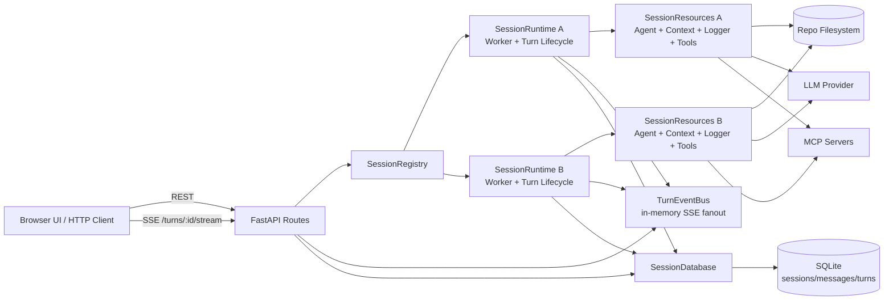
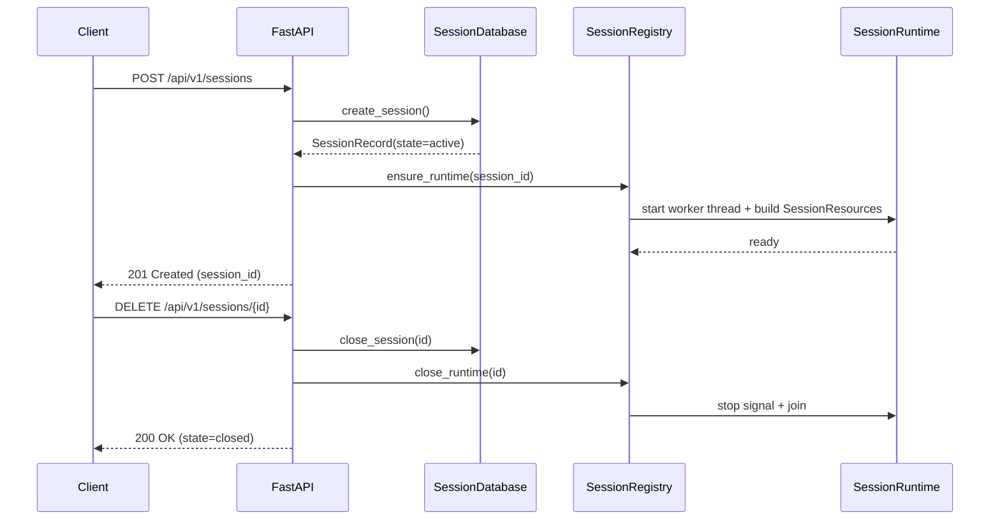
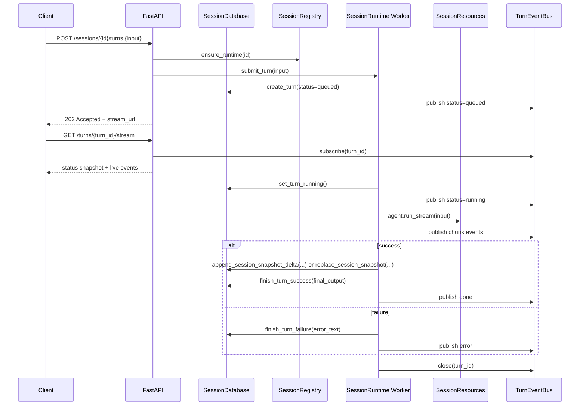

# BabyClaw HTTP Design (Session-Scoped Agents)

## Overview

HTTP mode is intentionally local and simple:

- one daemon process per repo root
- one long-running `Agent` per HTTP session
- one dedicated worker thread per session runtime
- SQLite persistence for sessions, turns, and transcript snapshot
- live-only SSE token streaming keyed by `turn_id`

This is a hard break from the earlier run-scoped design.

## Architecture

## Internal Modules

- `src/server/session_resources.py`: builds one loaded per-session resource bundle from a persisted session snapshot.
- `src/server/session_runtime.py`: owns the long-running worker thread, turn execution, SSE emission, and transcript persistence policy.
- `src/server/session_registry.py`: lazy process-local registry of loaded session runtimes.
- `src/database/session_database.py`: SQLite access with three distinct read shapes:
  - `record`: one persisted row summary
  - `detail`: expanded API-facing session view
  - `snapshot`: minimal hydration view for runtime construction
- `src/server/admin_collectors_core.py`: admin resources sourced directly from database and app state.
- `src/server/admin_collectors_runtime.py`: admin resources derived from loaded runtime snapshots.
- `src/server/admin_logs.py`: log file listing, tailing, download resolution, and path safety checks.

## Session Lifecycle

## Turn Execution Workflow

## Runtime Rules

- `session_id` is server-issued and stable across reconnects.
- Each session has exactly one long-lived main agent runtime.
- Session runtime survives SSE disconnects.
- Subagent concurrency inside each turn still uses `subagents.max_parallel` and `subagents.max_per_turn`.
- Turn submission policy is `reject when busy` (`409`), no per-session turn queue.
- Cold restart behavior:
  - runtimes are lost (in-memory)
  - persisted sessions remain
  - first turn request lazily rehydrates runtime
  - stale `queued/running` turns are marked `failed` at startup

## Persistence Model

Tables:

- `sessions(id, title, summary_text, summary_json, state, closed_at, created_at, updated_at)`
- `messages(id, session_id, turn_id, seq, role, content, created_at)`
- `turns(id, session_id, status, input_text, final_output, error_text, created_at, started_at, ended_at, updated_at)`

Indexes:

- `messages(session_id, seq)`
- `messages(session_id, turn_id)`
- `turns(session_id, created_at)`
- `turns(status, created_at)`

Migration notes:

- schema versioning uses `PRAGMA user_version`
- v2 migration renames:
  - `runs` -> `turns`
  - `messages.run_id` -> `messages.turn_id`
- v2 adds session lifecycle columns:
  - `sessions.state`
  - `sessions.closed_at`

## HTTP API Surface

- `GET /api/v1/health`
- `GET /api/v1/sessions`
- `POST /api/v1/sessions`
- `GET /api/v1/sessions/{session_id}`
- `DELETE /api/v1/sessions/{session_id}`
- `POST /api/v1/sessions/{session_id}/turns`
- `GET /api/v1/turns/{turn_id}`
- `GET /api/v1/turns/{turn_id}/stream`

## SSE Contract

Event names:

- `status`
- `chunk`
- `done`
- `error`
- `heartbeat`

Rules:

- `chunk` events are live only and never persisted.
- reconnect to active turn gets a status snapshot, then live tail events.
- reconnect to terminal turn gets one terminal event (`done` or `error`) then closes.

## Admin Console

Admin is a dedicated read-only surface at `/admin` backed by `/api/v1/admin/*`.

Design goals:

- Kubernetes-style resource envelopes (`apiVersion`, `kind`, `metadata`, `spec`, `status`)
- read-only introspection of persisted and in-memory state
- redacted-by-default payload visibility
- dedicated admin SSE feed for live object updates
- session-centric exploration composed in the browser from the existing admin APIs

### Admin Resources

- `ServerOverview`
- `Session` / `SessionList`
- `SessionRuntime` / `SessionRuntimeList`
- `Turn` / `TurnList`
- `EventBusState`
- `AgentRuntime`
- `ToolRegistryState`
- `SkillCatalogState`
- `MCPServerState`
- `SubagentRun`
- `LogSession`
- `LogFile`
- `ConfigView`

### Admin API Surface

- `GET /admin`
- `GET /api/v1/admin/overview`
- `GET /api/v1/admin/sessions`
- `GET /api/v1/admin/sessions/{session_id}`
- `GET /api/v1/admin/runtimes`
- `GET /api/v1/admin/runtimes/{session_id}`
- `GET /api/v1/admin/turns`
- `GET /api/v1/admin/turns/{turn_id}`
- `GET /api/v1/admin/event-bus`
- `GET /api/v1/admin/agent-runtimes/{session_id}`
- `GET /api/v1/admin/tools`
- `GET /api/v1/admin/skills`
- `GET /api/v1/admin/mcp`
- `GET /api/v1/admin/subagents`
- `GET /api/v1/admin/log-sessions`
- `GET /api/v1/admin/log-files`
- `GET /api/v1/admin/log-files/tail`
- `GET /api/v1/admin/log-files/download`
- `GET /api/v1/admin/config`
- `GET /api/v1/admin/stream`

### Admin UI Shape

The admin frontend is intentionally thin:

- the backend keeps flat resource endpoints
- the browser composes those resources into a session-rooted tree explorer
- session expansion is lazy:
  - root sessions come from `GET /api/v1/admin/sessions`
  - session children fetch their own scoped resources on selection or expansion
  - turn and log child nodes are materialized only when those branches are opened
- admin SSE is used for connection status, root freshness, and cache invalidation rather than full subtree streaming

The resulting UI has three panes:

- left rail: global roots (`Overview`, `Sessions`, `Global Turns`, `Event Bus`, `Config`)
- center tree: session nodes and their children (`Session`, `Context`, `Runtime`, `Agent`, `Skills`, `Tools`, `MCP`, `Subagents`, `Turns`, `Logs`)
- right detail pane: `Summary`, `Related`, `Raw JSON`

### Admin Streaming

`/api/v1/admin/stream` emits:

- `snapshot`
- `resource_changed`
- `heartbeat`
- `error`

with envelopes carrying `resource`, `name`, `resourceVersion`, and `payload`.

### Admin Safety Contract

- admin endpoints are `GET` only.
- secret-like values are masked with `***REDACTED***` by default.
- textual payload previews are truncated by default.
- raw log bytes require explicit download endpoint.
- log file access is constrained to configured log root and rejects traversal/symlink escapes.
