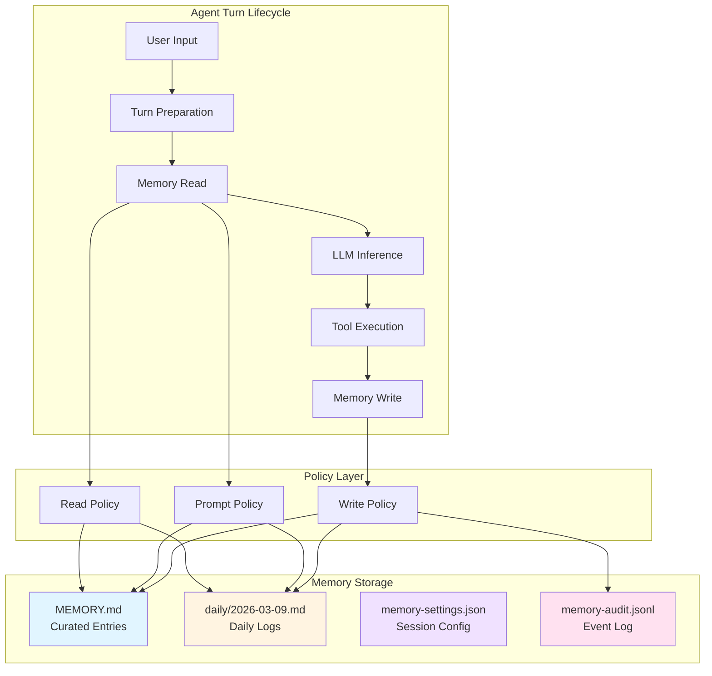
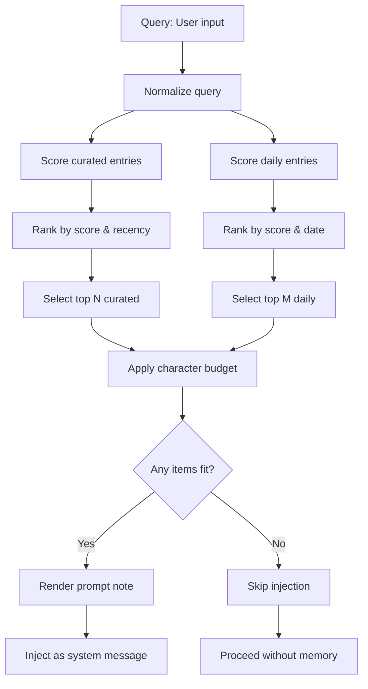
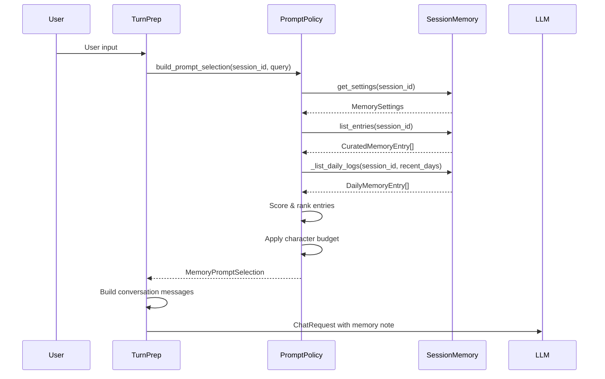
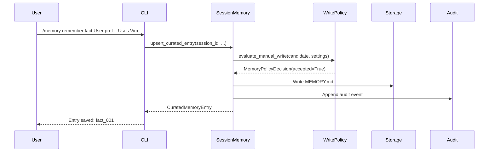
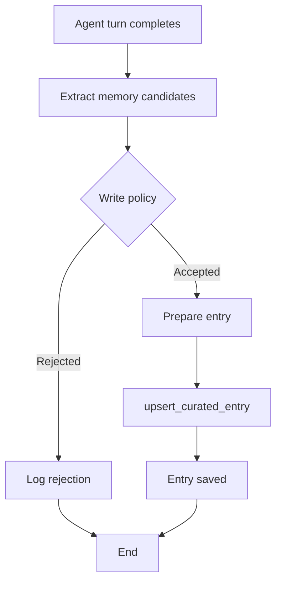

# Agent Memory System

## Abstract

The nano-claw Agent Memory system provides persistent, queryable context across AI coding sessions while respecting finite LLM context windows. Unlike ephemeral conversation history, memory offers structured, durable storage of facts, decisions, tasks, and notes that can be automatically retrieved and injected into relevant future turns. The system uses human-readable Markdown files for storage, ensuring transparency, portability, and debuggability while providing policy-based validation, ranked search, and bounded prompt injection.

## Table of Contents

1. [Architecture Overview](#architecture-overview)
2. [Memory Surfaces](#memory-surfaces)
3. [Data Model](#data-model)
4. [Policy System](#policy-system)
5. [Read Path](#read-path)
6. [Write Path](#write-path)
7. [Agent Integration](#agent-integration)
8. [Configuration](#configuration)
9. [Security Model](#security-model)
10. [Operational Characteristics](#operational-characteristics)

---

## Architecture Overview

The memory system implements a dual-surface architecture with clear separation between curated durable knowledge and temporary daily logs.



### Design Principles

1. **Human-First Storage**: Memory lives in Markdown files users can read, edit, and version control
2. **Policy-Guarded Mutability**: All writes pass through validation policies preventing secrets, low-value content, and reasoning traces
3. **Bounded Injection**: Memory automatically injected into prompts respects strict character limits
4. **Separation of Concerns**: Read policies (search behavior) and prompt policies (injection behavior) are independently configured
5. **Observable Operations**: All memory operations emit debug events and audit trail entries

### Core Components

| Component | Location | Purpose |
|-----------|----------|---------|
| **SessionMemory** | `src/memory/session_memory.py` | Central API for all memory operations |
| **Types** | `src/memory/types.py` | Data structures for entries, settings, search results |
| **Read Policy** | `src/memory/read_policy.py` | Default search behavior for `memory_search` tool |
| **Prompt Policy** | `src/memory/prompt_policy.py` | Automatic memory selection and injection |
| **Write Policy** | `src/memory/write_policy.py` | Validation for manual and autonomous writes |
| **Memory Tools** | `src/tools/memory.py` | Agent-facing tools (`memory_read`, `memory_search`, `memory_write`) |
| **Memory Commands** | `src/commands/memory_cmds.py` | CLI commands (`/memory`, `/memory remember`, `/memory daily`) |

---

## Memory Surfaces

The system provides two complementary storage surfaces with distinct use cases.

### Curated Memory (MEMORY.md)

Structured, long-lived knowledge organized by kind:

```markdown
## Facts
### entry_id: fact_001
- kind: fact
- title: User identity
- created_at: 2026-03-09T12:00:00Z
- updated_at: 2026-03-09T14:30:00Z
- confidence: 1.0
- status: active

Senior software engineer working on nano-claw memory system refactoring.

## Decisions
### entry_id: decision_001
- kind: decision
- title: Markdown storage format
- status: active

Store memory in human-readable Markdown for transparency and debuggability.

## Tasks
### entry_id: task_001
- kind: task
- title: Write comprehensive memory documentation

Create professional docs covering architecture, policies, and workflows.

## Notes
### entry_id: note_001
- kind: note
- status: archived

Initial exploration of RAG-based memory (superseded by structured approach).
```

**Entry Metadata Fields:**
- `entry_id`: UUID-based unique identifier
- `kind`: One of `fact`, `decision`, `task`, `note`
- `title`: Human-readable heading
- `content`: Body text
- `source`: Origin (`manual`, `tool`, `web`, `autonomous`)
- `created_at` / `updated_at`: ISO 8601 timestamps
- `confidence`: Float 0.0-1.0 (optional)
- `last_verified_at`: Last validation timestamp (optional)
- `status`: `active`, `archived`, or `superseded`
- `supersedes`: Entry ID replaced by this one (for evolution tracking)

### Daily Logs (daily/YYYY-MM-DD.md)

Append-only chronological journal:

```markdown
# 2026-03-09

## 14:30 — Refactoring memory policies
Reviewed write_policy.py and simplified validation logic. Moved secret detection
patterns to module-level constants for reusability.

## 09:15 — Initial architecture sketch
Explored dual-surface design with curated vs. daily separation.
```

**Daily Entry Structure:**
- `date`: ISO date string (YYYY-MM-DD)
- `heading`: Timestamped title
- `content`: Body text
- `path`: File path for reference

---

## Data Model

### Memory Kinds

| Kind | Purpose | Example |
|------|---------|---------|
| `fact` | Stable truths about user, project, environment | "User prefers Vim over Emacs" |
| `decision` | Chosen approaches, architectural choices | "Use Markdown for storage" |
| `task` | Actionable follow-ups, obligations | "Write memory documentation" |
| `note` | Useful but less stable context | "Explored RAG approaches (archived)" |

### Memory Modes

Per-session configuration controlling write behavior:

| Mode | Manual Writes | Autonomous Writes | Auto-Retrieval |
|------|--------------|-------------------|----------------|
| `off` | Blocked | Blocked | Disabled |
| `manual_only` | Allowed | Blocked | Enabled |
| `auto` | Allowed | Allowed | Enabled |

### Memory Settings

Stored per-session in `memory-settings.json`:

```python
@dataclass(frozen=True)
class MemorySettings:
    mode: MemoryMode = "manual_only"           # Write permission
    read_policy: MemoryReadPolicyName = "curated_plus_recent_daily"
    prompt_policy: MemoryPromptPolicyName = "curated_plus_recent_daily"
```

### Policy Names

Applied independently for search and prompt injection:

| Policy | Behavior |
|--------|----------|
| `curated_only` | Search/inject only curated memory, never daily logs |
| `curated_plus_recent_daily` | Curated memory plus daily logs from last N days |
| `search_all_ranked` | Full-text search across both surfaces, ranked by relevance |

---

## Policy System

The policy layer validates all memory operations and controls retrieval behavior.

### Write Policy

Located in `src/memory/write_policy.py`, validates both manual and autonomous writes.

**Security Checks (Applied to All Writes):**
```python
def contains_secret_like_text(text: str) -> bool:
    """Detect API keys, access tokens, passwords."""
    patterns = [
        r"\bsk-[A-Za-z0-9]{16,}\b",           # OpenAI-style keys
        r"\bAKIA[0-9A-Z]{16}\b",              # AWS access keys
        r"\b(api[_ -]?key|secret|password)\b.{0,32}[:=]\s*\S+",
    ]
    return any(pattern.search(text) for pattern in patterns)

def contains_reasoning_trace(text: str) -> bool:
    """Block chain-of-thought leakage into durable storage."""
    patterns = [
        r"\bchain[- ]of[- ]thought\b",
        r"\bhidden reasoning\b",
        r"\binternal reasoning\b",
    ]
    return any(pattern.search(text) for pattern in patterns)
```

**Manual Write Validation** (user/tool/API initiated):
```python
def evaluate_manual_write(candidate: MemoryWriteCandidate, settings: MemorySettings):
    if settings.mode == "off":
        return MemoryPolicyDecision(False, "session memory mode is off")
    if contains_secret_like_text(text):
        return MemoryPolicyDecision(False, "memory content looks secret-like")
    if contains_reasoning_trace(text):
        return MemoryPolicyDecision(False, "chain-of-thought style content cannot be persisted")
    if candidate.source in {"tool", "web"} and candidate.confidence < 0.75:
        return MemoryPolicyDecision(False, "tool- or web-derived memory requires confidence >= 0.75")
    return MemoryPolicyDecision(True, "accepted")
```

**Autonomous Write Validation** (agent extracted from responses):
```python
def evaluate_autonomous_write(candidate: MemoryWriteCandidate, settings: MemorySettings):
    if settings.mode != "auto":
        return MemoryPolicyDecision(False, "session memory mode does not allow autonomous writeback")
    if contains_secret_like_text(text):
        return MemoryPolicyDecision(False, "memory content looks secret-like")
    if contains_reasoning_trace(text):
        return MemoryPolicyDecision(False, "chain-of-thought style content cannot be persisted")
    if len(candidate.content.strip()) < 16:
        return MemoryPolicyDecision(False, "memory candidate is too short to be durable")
    if any(pattern.match(candidate.title) for pattern in _LOW_VALUE_TITLE_PATTERNS):
        return MemoryPolicyDecision(False, "memory title is too generic")  # Catches "note", "todo", etc.
    if candidate.confidence is not None and candidate.confidence < 0.65:
        return MemoryPolicyDecision(False, "memory candidate confidence is too low")
    return MemoryPolicyDecision(True, "accepted")
```

### Read Policy

Located in `src/memory/read_policy.py`, configures default `memory_search` tool behavior.

```python
def build_search_plan(
    memory: SessionMemory,
    session_id: str,
    *,
    query: str,
    limit: int | None = None,
    include_daily: bool | None = None,
    include_inactive: bool | None = None,
) -> MemorySearchPlan:
    """Resolve the default memory_search behavior for one session."""
    settings = memory.get_settings(session_id)
    policy_name = settings.read_policy

    # Resolve limits based on policy and config
    configured_limit = memory.runtime_config.memory.max_search_results
    requested_limit = configured_limit if limit is None else int(limit)
    resolved_limit = max(1, min(requested_limit, configured_limit))

    # Default include_daily based on policy
    if include_daily is None:
        resolved_include_daily = policy_name != "curated_only"
        recent_daily_days = (
            memory.runtime_config.memory.recent_daily_days
            if policy_name == "curated_plus_recent_daily"
            else None
        )
    else:
        resolved_include_daily = bool(include_daily)
        recent_daily_days = None

    return MemorySearchPlan(
        policy_name=policy_name,
        query=query,
        limit=resolved_limit,
        include_daily=resolved_include_daily,
        include_inactive=resolved_include_inactive,
        recent_daily_days=recent_daily_days,
    )
```

### Prompt Policy

Located in `src/memory/prompt_policy.py`, controls automatic memory injection into system prompts.

**Policy Behaviors:**

1. **`curated_only`**: Searches curated memory, ranks by relevance, injects top results
2. **`curated_plus_recent_daily`**: Adds daily logs from last N days (default: 7)
3. **`search_all_ranked`**: Full-text search across both surfaces, unified ranking

**Bounded Injection Process:**



**Character Budget Enforcement:**
- Total budget: `runtime_config.memory.max_auto_chars` (default: 2000)
- Per-policy limits: `max_auto_curated_hits`, `max_auto_daily_hits`
- Items added in order until budget exhausted
- Truncation marker (…) added when budget exceeded

---

## Read Path

Memory reading occurs at two points: during turn preparation (automatic injection) and during agent execution (explicit tool calls).

### Automatic Injection (Turn Preparation)



**Code Flow:**

1. **`prepare_turn_input()`** (src/agent_turn_prep.py):
   ```python
   if memory_store is not None and runtime_config is not None:
       selection = memory_store.build_prompt_memory(
           context.session_id,
           normalized_user_message,
       )
       if selection is not None:
           memory_note = selection.note
           memory_prompt_items = selection.items
           memory_prompt_policy = selection.policy_name
   ```

2. **`build_conversation_messages()`**:
   ```python
   if memory_note:
       messages.append({"role": "system", "content": memory_note})
   ```

3. **Injection Format:**
   ```
   Session memory:

   - [fact] User identity (updated 2026-03-09, confidence 1.00)
     Senior software engineer working on nano-claw memory system.

   - [decision] Markdown storage format
     Store memory in human-readable Markdown for transparency.

   Recent daily notes:

   - [2026-03-09] Refactoring memory policies
     Reviewed write_policy.py and simplified validation logic.
   ```

### Explicit Search (Tool Execution)

When the agent calls `memory_search`, the read policy determines search behavior:

```python
# In src/tools/memory.py
class MemorySearchTool(Tool):
    name = "memory_search"
    description = "Search curated memory and daily logs for relevant context..."

    def execute(self, context, **kwargs):
        query = self._require_param(kwargs, "query")
        session_id = context.session_id

        # Build search plan based on session's read policy
        plan = self.memory_store.build_search_plan(
            session_id,
            query=query,
            limit=kwargs.get("limit"),
            include_daily=kwargs.get("include_daily"),
            include_inactive=kwargs.get("include_inactive"),
        )

        # Execute search
        hits = self.memory_store.search(
            session_id,
            query=plan.query,
            limit=plan.limit,
            include_daily=plan.include_daily,
            include_inactive=plan.include_inactive,
            recent_daily_days=plan.recent_daily_days,
            actor="tool",
            policy_name=plan.policy_name,
        )

        return ToolResult(success=True, data=_format_search_results(query, hits))
```

**Scoring Algorithm:**

```python
def _score_curated_entry(entry: CuratedMemoryEntry, normalized_query: str) -> float:
    """Rank curated entries by query relevance."""
    title_lower = entry.title.lower()
    content_lower = entry.content.lower()
    query_lower = normalized_query.lower()

    score = 0.0

    # Exact title match
    if query_lower == title_lower:
        score += 2.0

    # Title contains query
    if query_lower in title_lower:
        score += 1.0

    # Content contains query (multiple occurrences)
    content_count = content_lower.count(query_lower)
    score += min(content_count * 0.3, 1.5)

    # Kind-specific boosts
    if entry.kind == "fact":
        score += 0.2
    elif entry.kind == "decision":
        score += 0.1

    # Active entries preferred
    if entry.status == "active":
        score += 0.3

    # Recency bonus (for updated_at)
    if entry.updated_at:
        days_old = (datetime.now(timezone.utc) - datetime.fromisoformat(entry.updated_at)).days
        if days_old < 7:
            score += 0.2
        elif days_old < 30:
            score += 0.1

    return round(score, 3)
```

---

## Write Path

Memory writes originate from three sources: manual user commands, agent tool calls, and autonomous extraction from assistant responses.

### Manual Write (CLI Commands)



**Example CLI Usage:**

```bash
# Add curated memory
/memory remember fact User identity :: Senior software engineer
/memory remember decision Storage format :: Use Markdown for transparency
/memory remember task Write docs :: Create comprehensive memory documentation

# Add daily log
/memory daily Morning progress :: Reviewed memory architecture

# Configure session
/memory mode auto
/memory read-policy curated_plus_recent_daily
/memory prompt-policy search_all_ranked
```

### Tool Write (Agent Initiated)

The agent can write memory via tools during execution:

```python
# In src/tools/memory.py
class MemoryWriteTool(Tool):
    name = "memory_write"
    description = "Persist new curated memory or daily log entries..."

    def execute(self, context, **kwargs):
        action = self._require_param(kwargs, "action")

        if action == "upsert_curated":
            return self._upsert_curated(context, **kwargs)
        elif action == "append_daily":
            return self._append_daily(context, **kwargs)
        elif action == "archive_curated":
            return self._archive_curated(context, **kwargs)
        # ... other actions

    def _upsert_curated(self, context, **kwargs):
        entry = self.memory_store.upsert_curated_entry(
            context.session_id,
            kind=kwargs["kind"],
            title=kwargs["title"],
            content=kwargs["content"],
            reason=kwargs.get("reason", "tool write"),
            source="tool",
            confidence=kwargs.get("confidence"),
            actor="tool",
        )
        return ToolResult(success=True, data=f"Saved entry: {entry.entry_id}")
```

### Autonomous Write (Extracted from Responses)

After each turn, the system can extract memory candidates from assistant responses:



**Extraction Pattern:**

The system scans assistant responses for structured memory annotations:

```
fact: User prefers Vim :: User explicitly stated Vim preference in multiple sessions.

decision: Use Markdown for memory storage :: Chose for transparency, portability, and human debuggability.

task: Write comprehensive memory documentation :: Cover architecture, policies, workflows, and integration points.

note: Explored RAG approaches :: Initial research showed RAG is overkill for session-scoped memory.
```

**Autonomous Write Flow:**

```python
# In src/memory/session_memory.py
def extract_and_writeback(
    self,
    session_id: str,
    assistant_response: str,
    *,
    logger=None,
    turn_id: int | str | None = None,
) -> list[CuratedMemoryEntry]:
    """Extract memory candidates from assistant response and write valid ones."""
    settings = self.get_settings(session_id)

    if not settings.autonomous_write_enabled:
        return []

    candidates = self._extract_memory_candidates(
        assistant_response,
        source="autonomous",
    )

    saved_entries = []
    for candidate in candidates:
        try:
            entry = self.upsert_curated_entry(
                session_id,
                kind=candidate.kind,
                title=candidate.title,
                content=candidate.content,
                reason=candidate.reason,
                source=candidate.source,
                confidence=candidate.confidence,
                actor="autonomous",
                logger=logger,
                turn_id=turn_id,
            )
            saved_entries.append(entry)
        except ValueError as exc:
            # Policy rejection - log and continue
            self._emit_memory_debug(
                session_id,
                "debug_autonomous_write_rejected",
                logger=logger,
                turn_id=turn_id,
                kind=candidate.kind,
                title=candidate.title,
                rejection_reason=str(exc),
            )

    return saved_entries
```

---

## Agent Integration

Memory integrates with the agent lifecycle at three key points.

### 1. Initialization

```python
# In src/agent.py
class Agent:
    def __init__(
        self,
        llm_client,
        tools,
        context,
        memory_store=None,  # SessionMemory instance
        ...
    ):
        self.memory_store = memory_store
        self._build_system_prompt_base()
```

### 2. Turn Preparation

```python
# In src/agent_turn_prep.py
def prepare_turn_input(
    user_message: str,
    *,
    context,
    memory_store=None,
    runtime_config=None,
) -> PreparedTurnInput:
    """Normalize user message and collect memory for prompt injection."""
    memory_note: str | None = None
    memory_prompt_items: list[MemoryPromptItem] | None = None
    memory_prompt_policy: str | None = None

    if memory_store is not None and runtime_config is not None:
        selection = memory_store.build_prompt_memory(
            context.session_id,
            user_message,
        )
        if selection is not None:
            memory_note = selection.note
            memory_prompt_items = selection.items
            memory_prompt_policy = selection.policy_name

    return PreparedTurnInput(
        normalized_user_message=user_message,
        preload_skill_names=[],
        pending_skill_events=[],
        memory_note=memory_note,
        memory_prompt_items=memory_prompt_items,
        memory_prompt_policy=memory_prompt_policy,
    )
```

### 3. Turn Completion (Writeback)

```python
# In src/agent.py
def run(
    self,
    user_message: str,
    on_event: Optional[TurnActivityCallback] = None,
    ...
) -> str:
    """Execute one top-level agent turn with memory integration."""

    # Prepare turn with memory injection
    prepared_turn_input = prepare_turn_input(
        user_message,
        context=self.context,
        skill_manager=self.skill_manager,
        memory_store=self.memory_store,
        runtime_config=self.runtime_config,
    )

    # Record prompt injection for observability
    if self.memory_store is not None and prepared_turn_input.memory_prompt_items:
        self.memory_store.record_prompt_injection(
            self.context.session_id,
            query=prepared_turn_input.normalized_user_message,
            items=prepared_turn_input.memory_prompt_items,
            policy_name=prepared_turn_input.memory_prompt_policy,
        )

    # Build messages with memory note
    messages = build_conversation_messages(
        system_message=self._build_system_message(),
        summary_message=self.context.get_summary_message(),
        memory_note=prepared_turn_input.memory_note,
        history_messages=self.context.get_history(),
        ...
    )

    # Execute ReAct loop
    final_answer = self._run_turn_loop(messages, ...)

    # Autonomous memory writeback
    if self.memory_store is not None:
        self.memory_store.writeback_from_turn(
            self.context.session_id,
            assistant_response=final_answer,
            logger=self.logger,
            turn_id=turn_id,
        )

    return final_answer
```

### 4. Memory Usage Guidance

The system automatically injects guidance into the system prompt when memory tools are available:

```python
# In src/agent.py
def _build_memory_usage_prompt_section(self) -> str:
    """Build concise memory-usage guidance only when memory tools are available."""
    if self.tools.get("memory_search") is None or self.tools.get("memory_write") is None:
        return ""

    return "\n".join([
        "Session memory guidance:",
        "- Persist durable session facts that will matter later, especially identity, current workstream, preferences, constraints, decisions, and tasks.",
        "- Use memory_search before re-asking for known context already likely captured in session memory.",
        "- Use memory_write only for durable, safe information; do not store secrets, passwords, tokens, or one-off temporary chatter.",
        "- Prefer upsert_curated for durable memory and append_daily only for temporary journal-style notes.",
    ])
```

---

## Configuration

Memory behavior is configured via `config.yaml` and per-session settings.

### Global Configuration (config.yaml)

```yaml
memory:
  enabled: true
  debug: false

  # Storage paths
  root: ".nano-claw/sessions"

  # Default policies (can be overridden per session)
  default_read_policy: "curated_plus_recent_daily"
  default_prompt_policy: "curated_plus_recent_daily"

  # Search limits
  max_search_results: 20

  # Prompt injection limits
  max_auto_curated_hits: 5
  max_auto_daily_hits: 3
  max_auto_chars: 2000
  recent_daily_days: 7

  # Writeback configuration
  enable_autonomous_writeback: true
  max_autonomous_writes_per_turn: 3
```

### Per-Session Settings (memory-settings.json)

```json
{
  "mode": "auto",
  "read_policy": "curated_plus_recent_daily",
  "prompt_policy": "search_all_ranked",
  "updated_at": "2026-03-09T14:30:00Z"
}
```

### Configuration Impact

| Setting | Affects | Default | Rationale |
|---------|---------|---------|-----------|
| `mode` | Write permissions | `manual_only` | Conservative default; autonomous writes require explicit opt-in |
| `read_policy` | `memory_search` default | `curated_plus_recent_daily` | Balanced relevance vs. noise |
| `prompt_policy` | Automatic injection | `curated_plus_recent_daily` | Prefer curated knowledge, recent context |
| `max_auto_chars` | Prompt memory budget | 2000 | Prevent context bloat |
| `recent_daily_days` | Daily log window | 7 | Weekly recency window |
| `enable_autonomous_writeback` | Auto-extraction | `true` | Enable hands-free memory building |

---

## Security Model

The memory system implements defense-in-depth to prevent unsafe data persistence.

### Threat Model

| Threat | Mitigation |
|--------|------------|
| **Secret leakage** | Pattern-based detection in write policy |
| **Reasoning trace persistence** | Chain-of-thought keyword filtering |
| **Low-value content spam** | Minimum length, title quality checks |
| **Autonomous write abuse** | Confidence thresholds, write count limits |
| **Injection attacks** | Markdown sanitization, entry validation |

### Secret Detection Patterns

```python
_SECRET_PATTERNS = [
    re.compile(r"\bsk-[A-Za-z0-9]{16,}\b"),           # OpenAI API keys
    re.compile(r"\bAKIA[0-9A-Z]{16}\b"),              # AWS access keys
    re.compile(r"(?i)\b(api[_ -]?key|access[_ -]?token|secret|password)\b.{0,32}[:=]\s*\S+"),
]
```

### Content Quality Gates

**Manual writes:**
- Minimum 16 characters for autonomous writes
- Non-generic titles (reject "note", "todo", "memory")
- Confidence ≥ 0.75 for tool/web sources

**Autonomous writes:**
- Minimum 16 characters
- Non-generic titles
- Confidence ≥ 0.65 (lower than manual due to extraction uncertainty)
- Maximum 3 writes per turn

### Audit Trail

All memory operations are logged to `memory-audit.jsonl`:

```json
{"event": "write_accepted", "actor": "manual", "action": "upsert_curated", "outcome": "created", "entry_id": "fact_001", "kind": "fact", "title": "User identity", "timestamp": "2026-03-09T14:30:00Z"}
{"event": "write_rejected", "actor": "autonomous", "action": "upsert_curated", "kind": "fact", "title": "Generic note", "rejection_reason": "memory title is too generic", "timestamp": "2026-03-09T14:31:00Z"}
{"event": "settings_updated", "mode": "auto", "read_policy": "curated_plus_recent_daily", "prompt_policy": "search_all_ranked", "timestamp": "2026-03-09T14:32:00Z"}
{"event": "prompt_injection", "policy_name": "curated_plus_recent_daily", "item_count": 3, "char_count": 1247, "timestamp": "2026-03-09T14:33:00Z"}
```

---

## Operational Characteristics

### Performance

| Operation | Complexity | Notes |
|-----------|------------|-------|
| `upsert_curated_entry` | O(n) | n = entry count (file rewrite) |
| `search` | O(n × m) | n = entries, m = query terms (in-memory) |
| `build_prompt_selection` | O(n × m) | Scoring all entries against query |
| `extract_and_writeback` | O(k) | k = candidates (typically < 5) |

**Optimization Notes:**
- All operations are in-memory after initial file read
- File I/O is batched (single write per operation)
- Search is optimized by early exit on score > 0
- Character budget prevents excessive prompt injection

### Scalability Limits

| Dimension | Limit | Rationale |
|-----------|-------|-----------|
| Entries per session | ~100-200 | Beyond this, search latency degrades |
| Daily logs | Unbounded | Append-only, searched only recent window |
| Prompt injection chars | 2000 (configurable) | Prevents context bloat |
| Concurrent writes | 1 (thread-locked) | Prevents file corruption |

### Failure Modes

| Scenario | Behavior | Recovery |
|----------|----------|----------|
| **Settings file corrupt** | Fall back to defaults | Re-create via `/memory mode` |
| **MEMORY.md corrupt** | Parse error, read fails | User edits manually |
| **Write policy rejects** | ValueError with reason | Adjust content or title |
| **Autonomous write fails** | Logged, skipped | No user action needed |
| **Search fails** | Empty results | Check query spelling |

### Debugging

Enable verbose memory tracing:

```bash
# Set environment variable
export MEMORY_DEBUG=true
export NANO_CLAW_LOG_LEVEL=debug

# Or enable in config.yaml
memory:
  debug: true
```

**Debug Output Includes:**
- Write request details (kind, title, source, confidence)
- Policy decisions (accepted/rejected with reason)
- Search scores for all entries
- Prompt injection character counts
- Autonomous extraction candidates

---

## Design Trade-offs

### Chosen Approaches

1. **Markdown over Database**
   - **Pro**: Human-readable, version-control friendly, zero infrastructure
   - **Con**: Slower than SQLite for large datasets
   - **Decision**: Session-scoped memory rarely exceeds hundreds of entries

2. **Dual Surface (Curated + Daily)**
   - **Pro**: Clear separation of durable vs. temporary context
   - **Con**: Two files to manage, potential duplication
   - **Decision**: Enables "journalling" workflow without polluting curated memory

3. **Policy-Based Validation**
   - **Pro**: Prevents secrets, low-value content, reasoning traces
   - **Con**: False positives, over-blocking
   - **Decision**: Security and quality override convenience

4. **Bounded Prompt Injection**
   - **Pro**: Predictable token usage, prevents context bloat
   - **Con**: May exclude relevant memory
   - **Decision**: Agent can explicitly search if injection misses

5. **Autonomous Writeback**
   - **Pro**: Hands-free memory building, captures context without user effort
   - **Con**: Risk of low-quality entries, hallucinations
   - **Decision**: Conservative validation, confidence thresholds, disable-able

### Future Considerations

1. **Embedding-Based Search**
   - Current: Keyword-based scoring
   - Future: Vector embeddings for semantic search
   - **Trade-off**: Adds dependency on embedding model, increases complexity

2. **Cross-Session Memory**
   - Current: Per-session isolation
   - Future: Global memory profile shared across sessions
   - **Trade-off**: Privacy concerns, stale context propagation

3. **Memory Consolidation**
   - Current: Manual archival/supersession
   - Future: Automatic summarization, deduplication
   - **Trade-off**: Risk of information loss, complexity

4. **Memory Versioning**
   - Current: `updated_at` timestamp, manual `supersedes`
   - **Future: Git-style version history, diff view
   - **Trade-off**: Storage overhead, UI complexity

---

## Best Practices

### For Users

1. **Use facts for stable truths**: Identity, preferences, constraints
2. **Use decisions for chosen approaches**: Architecture, tool choices, patterns
3. **Use tasks for follow-ups**: Action items, obligations, future work
4. **Use notes sparingly**: Only for useful but unstable context
5. **Archive outdated entries**: Don't delete, archive for historical context
6. **Use daily logs for journaling**: Temporary observations, progress updates
7. **Enable autonomous mode selectively**: Start with `manual_only`, upgrade to `auto` after trust established

### For Developers Extending the System

1. **Add new kinds cautiously**: Each kind adds UI/UX complexity
2. **Preserve Markdown compatibility**: All parses must handle user-edited files
3. **Test policy rejections**: Verify security checks trigger appropriately
4. **Log all mutations**: Audit trail is critical for debugging
5. **Respect character budgets**: Prompt injection limits are hard constraints
6. **Keep search deterministic**: Same query should produce same order
7. **Handle malformed files**: Users may edit Markdown manually

### For Operators

1. **Monitor audit logs**: Check for frequent rejections indicating policy misalignment
2. **Review memory quality**: Periodic sanity checks of MEMORY.md contents
3. **Tune budgets**: Adjust `max_auto_chars` based on actual usage patterns
4. **Profile search latency**: If searches exceed 100ms, consider optimization
5. **Backup session directories**: Memory is user data, treat as such

---

## References

- **Source Code**: `src/memory/`
- **Tools**: `src/tools/memory.py`
- **CLI Commands**: `src/commands/memory_cmds.py`
- **Agent Integration**: `src/agent.py`, `src/agent_turn_prep.py`
- **Configuration**: `config.yaml.example`
- **Tests**: `tests/test_memory.py`, `tests/test_context_compaction.py`
