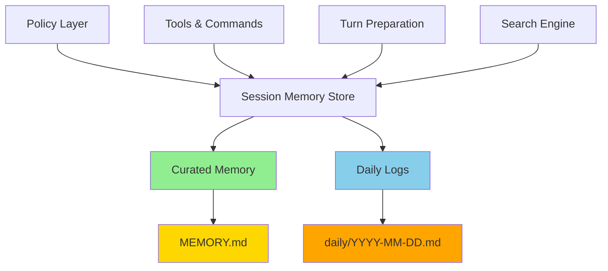
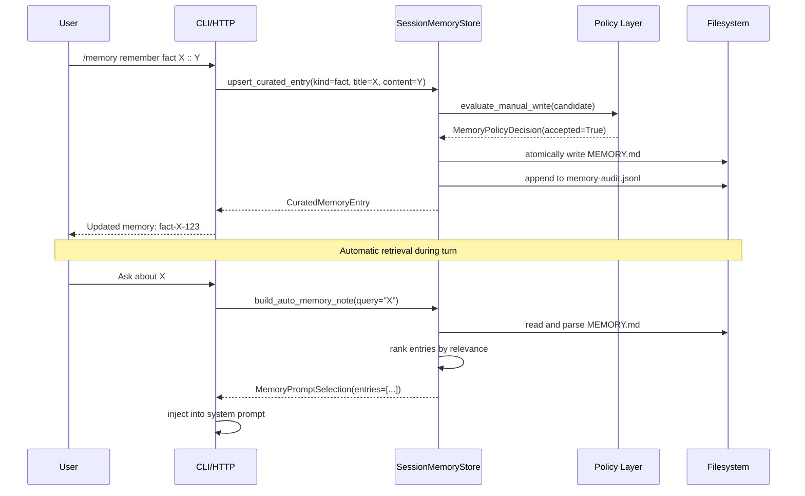
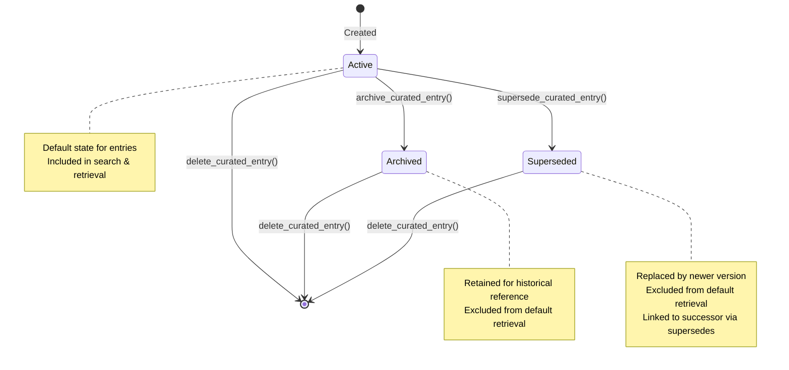
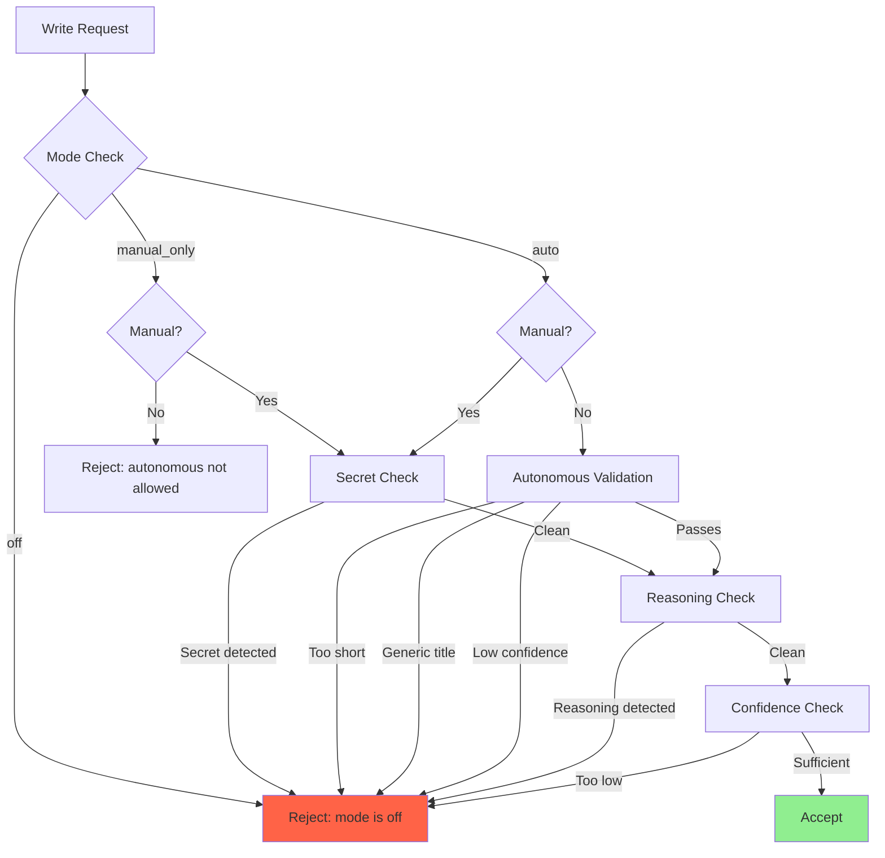

# Session Memory: Technical Architecture & Implementation Guide

## Abstract

This document provides comprehensive technical documentation for nano-claw's managed Markdown session memory subsystem. Session memory is a critical infrastructure component that enables long-running AI coding sessions to maintain persistent, queryable context across turns while respecting finite LLM context windows. Unlike ephemeral conversation history, session memory provides structured, durable storage of important facts, decisions, tasks, and notes that can be automatically retrieved and injected into relevant future turns. The system uses human-readable Markdown files as the storage format, ensuring transparency, portability, and debuggability while providing policy-based validation, ranked search, and bounded prompt injection. This document explains the problem domain, architectural decisions, implementation details, configuration options, operational characteristics, and production considerations.

---

## Table of Contents

1. [Problem Statement](#problem-statement)
2. [Architectural Overview](#architectural-overview)
3. [Core Components](#core-components)
4. [Memory Surfaces](#memory-surfaces)
5. [Entry Structure & Lifecycle](#entry-structure--lifecycle)
6. [Policy System](#policy-system)
7. [Search & Retrieval](#search--retrieval)
8. [Integration Points](#integration-points)
9. [Configuration](#configuration)
10. [Observable State](#observable-state)
11. [Error Handling](#error-handling)
12. [Performance Characteristics](#performance-characteristics)
13. [Migration Strategy](#migration-strategy)
14. [Operational Guidance](#operational-guidance)
15. [Security Considerations](#security-considerations)
16. [Design Trade-offs](#design-trade-offs)
17. [Best Practices](#best-practices)
18. [Examples](#examples)
19. [Future Work](#future-work)

---

## Problem Statement

### The Context Window Crisis

AI coding agents operate within finite LLM context windows that limit the amount of information available in any single turn. As conversations progress, each turn adds tokens to the conversation history, gradually consuming the available context budget. Without intervention, long-running sessions eventually exceed the context window, causing failures or requiring blind truncation that loses important context.

While nano-claw's context compaction system ([docs/context-compaction.md](context-compaction.md)) addresses this by summarizing older conversation turns, summaries have inherent limitations:

- **Information Loss**: Summaries necessarily lose detail—what gets omitted may be exactly what's needed later
- **Query Difficulty**: Finding specific information in a summary requires reading the entire summary
- **Update Challenges**: Correcting or refining summarized information is cumbersome
- **Cross-Session Persistence**: Summaries don't naturally transfer between sessions

### Why Session Memory Matters

Session memory solves these problems by providing a **durable, queryable knowledge store** that operates independently of the conversation history:

1. **Selective Persistence**: Important facts, decisions, tasks, and notes are explicitly stored, not lost in summarization
2. **Efficient Retrieval**: Only relevant entries are retrieved based on the current query, minimizing context usage
3. **Human-Readable Storage**: Markdown files ensure transparency—users can read, edit, and version control memory
4. **Cross-Session Continuity**: Memory persists across sessions, enabling long-term knowledge accumulation
5. **Policy-Governed Safety**: Built-in guards prevent secret leakage and low-quality content pollution
6. **Observable Operations**: Full audit trail enables debugging and compliance

### Concrete Use Cases

Session memory excels in scenarios like:

- **User Identity**: "My name is Alice" or "Call me Casey" should be saved as durable session memory
- **Current Work Context**: "I'm working on the SSE reconnect bug" should be saved so the agent does not lose the thread later
- **Architecture Decisions**: "Use PostgreSQL for relational data, Redis for caching" persists across sessions
- **Stable Preferences**: "Use Ruff, not Black" should be saved as a durable preference or project fact
- **Deployment Procedures**: "Run migrations before deploy, verify health checks after" remains accessible
- **Debugging Insights**: "SSE reconnection fails due to connection header mismatch" can be retrieved when relevant
- **Project Context**: "API endpoint rate limits: 100 req/min per user" stays available without re-asking
- **Task Tracking**: "Add integration tests for memory policy validation" persists as a reminder

### Design Goals

The memory subsystem is built around these core principles:

1. **Durable but Queryable**: Persistent storage that remains searchable without loading everything into context
2. **Selective Injection**: Retrieve only relevant entries based on the current query
3. **Markdown-Native**: Human-readable and editable files that work with existing tooling
4. **Policy-Governed**: Guardrails preventing secret leakage and low-quality content
5. **Observable**: Full audit trail of reads, writes, and prompt injections
6. **Session-Scoped**: Memory lives per session, enabling clean isolation
7. **Graceful Degradation**: System functions even if memory is disabled or corrupted

---

## Architectural Overview

### Design Philosophy

The memory subsystem embraces **Markdown as the storage format** rather than a database. This choice prioritizes:

- **Transparency**: Users can read and edit memory files directly with any text editor
- **Portability**: Standard text files work with git, diff tools, and existing editors
- **Simplicity**: No schema migrations, ORM complexity, or indexing overhead
- **Debuggability**: Memory state is visible in plain text,便于 troubleshooting
- **Version Control Friendly**: Changes track naturally in git with human-readable diffs

The system uses a **dual-surface architecture** to separate different types of memory:



**Curated Memory** (`MEMORY.md`) stores structured, validated entries organized by kind (facts, decisions, tasks, notes). These entries are actively maintained and can be updated, archived, or superseded.

**Daily Logs** (`daily/YYYY-MM-DD.md`) provide append-only, timestamped notes for recording observations, progress updates, or temporary information. They remain searchable but are not automatically injected into prompts.

### System Architecture

```mermaid
C4Context
    title Session Memory System Architecture

    Person(user, "Developer", "Interacts via CLI/HTTP")
    Person(admin, "Administrator", "Monitors and maintains system")

    Container(agent, "AI Agent", "Uses memory during turns")
    Container(cli, "CLI Interface", "/memory commands")
    Container(http_api, "HTTP Server", "REST API for memory operations")

    Container(store, "SessionMemoryStore", "Core memory management")
    ContainerDb(curated, "MEMORY.md", "Structured curated entries")
    ContainerDb(daily, "daily/*.md", "Append-only daily logs")
    ContainerDb(settings, "memory-settings.json", "Per-session config")
    ContainerDb(audit, "memory-audit.jsonl", "Operation log")
    Container(policy, "Policy Layer", "Validation & filtering")
    Container(tools, "Memory Tools", "Read/Write/Search APIs")
    Container(commands, "Slash Commands", "CLI memory operations")
    Container(search, "Search Engine", "Ranked retrieval")

    User --> cli
    User --> http_api
    Admin --> http_api
    Agent --> tools
    Agent --> store

    cli --> commands
    http_api --> tools
    commands --> store
    tools --> store

    store --> search
    store --> policy
    store --> curated
    store --> daily
    store --> settings
    store --> audit
```

### Storage Layout

Memory is organized per-session in a dedicated directory structure:

```mermaid
graph TD
    A[sessions/] --> B[{session_id}/]
    B --> C[MEMORY.md]
    B --> D[daily/]
    B --> E[memory-settings.json]
    B --> F[memory-audit.jsonl]

    D --> G[2026-03-06.md]
    D --> H[2026-03-07.md]
    D --> I[2026-03-08.md]

    style C fill:#FFD700
    style E fill:#FFA500
    style F fill:#FF6347
```

**File purposes:**

- **MEMORY.md**: Curated structured memory with validated entries
- **daily/YYYY-MM-DD.md**: Append-only daily log entries
- **memory-settings.json**: Per-session configuration (mode, preferences)
- **memory-audit.jsonl**: Complete audit trail of all operations

### Data Flow



---

## Core Components

### 1. Data Models ([src/memory/models.py](src/memory/models.py))

The memory subsystem uses frozen dataclasses for immutable, thread-safe representations:

```python
from dataclasses import dataclass
from typing import Literal

MemoryKind = Literal["fact", "decision", "task", "note"]
MemoryStatus = Literal["active", "archived", "superseded"]
MemoryMode = Literal["off", "manual_only", "auto"]
```

#### CuratedMemoryEntry

Represents a single structured entry in `MEMORY.md`:

```python
@dataclass(frozen=True)
class CuratedMemoryEntry:
    """One structured entry parsed from MEMORY.md."""

    entry_id: str                # Unique identifier (UUID or legacy-*)
    kind: MemoryKind             # fact, decision, task, note
    title: str                   # Entry heading (kebab-case)
    content: str                 # Entry body text
    source: str | None           # Origin: cli, tool, web, http_api, assistant_auto
    created_at: str | None       # ISO8601 timestamp
    updated_at: str | None       # ISO8601 timestamp
    confidence: float | None     # 0-1 score for derived knowledge
    last_verified_at: str | None # When this was last confirmed
    status: MemoryStatus         # active, archived, superseded
    supersedes: str | None       # entry_id this replaces
```

**Field semantics:**

- `entry_id`: UUID v4 for new entries, `legacy-{kind}-{title-hash}` for manually created entries
- `kind`: Categorizes the entry for organization and filtering
- `title`: Short, descriptive heading using kebab-case
- `content`: Full markdown content supporting multiple paragraphs, code blocks, lists
- `source`: Attribution for debugging and policy evaluation
- `confidence`: Optional score (0-1) for machine-derived knowledge
- `status`: Lifecycle state—only `active` entries are retrieved by default
- `supersedes`: When set, indicates this entry replaces an earlier version

#### DailyMemoryEntry

Represents an append-only daily log entry:

```python
@dataclass(frozen=True)
class DailyMemoryEntry:
    """One append-only daily log entry."""

    date: str      # YYYY-MM-DD format
    heading: str   # Section heading (timestamp + title)
    content: str   # Entry body text
    path: str      # Full file path for reference
```

Daily logs are simpler than curated entries—they have no metadata, validation, or lifecycle management. They're designed for quick, timestamped notes.

#### MemorySettings

Per-session behavior configuration stored outside Markdown:

```python
@dataclass(frozen=True)
class MemorySettings:
    """Per-session memory behavior flags stored outside the Markdown document."""

    mode: MemoryMode = "manual_only"

    @property
    def auto_retrieve_enabled(self) -> bool:
        return self.mode != "off"

    @property
    def manual_write_enabled(self) -> bool:
        return self.mode in {"manual_only", "auto"}

    @property
    def autonomous_write_enabled(self) -> bool:
        return self.mode == "auto"
```

**Mode semantics:**

- **off**: Memory is disabled—no retrieval, no writes
- **manual_only**: Users can explicitly write, but automatic writeback is disabled
- **auto**: Both manual writes and autonomous writeback are enabled

#### MemorySearchHit

Search result with ranking metadata:

```python
@dataclass(frozen=True)
class MemorySearchHit:
    """One search hit from curated memory or daily logs."""

    scope: str               # "curated" or "daily"
    path: str                # Source file path
    title: str               # Entry heading
    snippet: str             # Context-extracted preview (~100 chars)
    entry_id: str | None     # For curated entries
    kind: str | None         # Memory kind
    status: str | None       # Entry status
    confidence: float | None # Confidence score
    created_at: str | None
    updated_at: str | None
    last_verified_at: str | None
    date: str | None         # For daily entries
    score: float = 0.0       # Relevance ranking (higher = better)
```

#### MemoryPromptSelection

Bounded entries for automatic prompt injection:

```python
@dataclass(frozen=True)
class MemoryPromptSelection:
    """Bounded memory entries selected for automatic prompt injection."""

    note: str                          # Formatted injection text
    entries: list[CuratedMemoryEntry]  # Selected entries
```

#### MemoryCandidate

Proposed memory extracted from turn outcome:

```python
@dataclass(frozen=True)
class MemoryCandidate:
    """Candidate long-term memory extracted from a turn outcome."""

    kind: MemoryKind
    title: str
    content: str
    reason: str
    source: str
    confidence: float | None = None
    last_verified_at: str | None = None
```

### 2. SessionMemoryStore ([src/memory/store.py](src/memory/store.py))

The core `SessionMemoryStore` class provides all memory operations:

```python
class SessionMemoryStore:
    def __init__(
        self,
        repo_root: Path,
        runtime_config: Config | None = None,
    ):
        self.repo_root = Path(repo_root)
        self.config = runtime_config or config
        self._memory_root = Path(
            self.config.memory.root_dir or DEFAULT_MEMORY_ROOT
        )
        self._lock = RLock()  # Thread-safety for concurrent access
```

**Key responsibilities:**

- **Path Resolution**: Map session IDs to filesystem locations
- **Document I/O**: Read/write Markdown files with atomic operations
- **Entry Management**: Create, update, archive, supersede, delete entries
- **Search**: Ranked retrieval across curated and daily memory
- **Prompt Building**: Select and format entries for injection
- **Autonomous Save**: Extract and validate memory from assistant responses
- **Audit Logging**: Record all operations for observability

**Thread Safety:**

All store operations use a reentrant lock (`RLock`) to ensure thread safety when accessed from multiple threads (e.g., HTTP server handling concurrent requests).

### 3. Policy Layer ([src/memory/policy.py](src/memory/policy.py))

The policy module validates write operations to prevent security issues and quality degradation:

```python
@dataclass(frozen=True)
class MemoryPolicyDecision:
    """Decision returned by the manual or autonomous write policy."""

    accepted: bool
    reason: str

def evaluate_manual_write(
    candidate: MemoryCandidate,
    settings: MemorySettings
) -> MemoryPolicyDecision:
    """Validate explicit human/tool/API writes."""

def evaluate_autonomous_write(
    candidate: MemoryCandidate,
    settings: MemorySettings
) -> MemoryPolicyDecision:
    """Validate conservative autonomous writeback candidates."""
```

**Policy checks:**

- **Secret Detection**: Blocks API keys, credentials, password-like patterns
- **Reasoning Trace Filtering**: Rejects chain-of-thought or internal reasoning
- **Quality Thresholds**: Enforces minimum content length and confidence scores
- **Mode Compliance**: Respects off/manual_only/auto restrictions

### 4. Memory Tools ([src/tools/memory.py](src/tools/memory.py))

Tools provide the agent with structured memory operations:

- **MemoryReadTool**: Inspect exact curated sections, entries, or daily logs when the agent needs direct reference or debugging
- **MemorySearchTool**: Default recall tool; search memory before re-asking the user for known identity, project context, preferences, constraints, decisions, or tasks
- **MemoryWriteTool**: Persist durable, safe session memory through structured mutations (upsert, update, archive, supersede, delete, append)

#### When the assistant should write curated memory

Baseline remembering is part of the core agent behavior. It should not require a special skill.

Use curated memory writes for durable session facts such as:

- the user's name or preferred form of address
- what project, feature, or bug they are actively working on
- stable preferences or constraints
- decisions the session should continue following
- reminders or tasks that should survive later turns

Prefer `upsert_curated` over `append_daily` for those cases. Use daily logs only for temporary journal-style notes.

Examples:

- `My name is Alice.` -> curated `fact`
- `I'm working on the SSE reconnect bug.` -> curated `fact` or `note`
- `Use Ruff, not Black.` -> curated `fact` or `decision`
- `Today I briefly checked an old experiment.` -> usually daily log or no memory write unless it clearly matters later

### 5. Slash Commands ([src/commands/memory_cmds.py](src/commands/memory_cmds.py))

CLI commands provide convenient memory management:

```
/memory                                    # Show memory summary
/memory show                               # Display MEMORY.md
/memory remember <kind> <title> :: <content>  # Add curated entry
/memory daily <title> :: <content>         # Add daily log entry
/memory search <query>                     # Search memory
/memory forget <kind> <title>              # Delete curated entry
/memory mode <off|manual_only|auto>        # Set memory mode
```

---

## Memory Surfaces

The memory subsystem provides two distinct surfaces optimized for different use cases:

### Curated Memory (MEMORY.md)

**Purpose**: Durable, validated knowledge that should persist and be readily accessible.

**Characteristics:**

- Structured entries with metadata (entry_id, timestamps, confidence)
- Organized by kind (Facts, Decisions, Tasks, Notes)
- Full lifecycle support (create, update, archive, supersede, delete)
- Policy-validated writes
- Automatically injected into relevant turns
- Version control friendly

**Example structure:**

```markdown
# Session Memory

## Facts

### deploy-order
- entry_id: fact-deploy-order-abc123
- source: cli
- created_at: 2026-03-06T12:00:00Z
- status: active

Run migrations before deploying services. Verify health checks after deploy.

## Decisions

### api-rate-limits
- entry_id: decision-api-rate-limits-def456
- source: http_api
- created_at: 2026-03-06T14:30:00Z
- status: active

Use 100 req/min per user for API endpoints. Implement token bucket algorithm.

## Tasks

### add-integration-tests
- entry_id: task-add-integration-tests-ghi789
- source: assistant_auto
- created_at: 2026-03-06T16:00:00Z
- confidence: 0.8
- status: active

Add integration tests for memory policy validation covering:
- Secret detection patterns
- Reasoning trace filtering
- Confidence threshold enforcement

## Notes

### debugging-sse-reconnect
- entry_id: note-debugging-sse-reconnect-jkl012
- source: cli
- created_at: 2026-03-06T17:15:00Z
- status: active

SSE reconnection fails when connection header differs between initial request and reconnection. Must preserve headers.
```

### Daily Logs (daily/YYYY-MM-DD.md)

**Purpose**: Append-only, timestamped notes for observations, progress updates, or temporary information.

**Characteristics:**

- Simple, flat structure—no metadata or validation
- Append-only—no updates or deletions
- Searchable but not auto-injected
- Useful for chronological tracking
- Lower friction than curated memory

**Example structure:**

```markdown
# Daily Log: 2026-03-06

## [2026-03-06 09:00] Session start

Starting work on API rate limiting feature.

## [2026-03-06 10:30] Investigation

Investigated SSE reconnection issue. Found header mismatch problem.

## [2026-03-06 14:00] Progress

Implemented token bucket rate limiter. Needs testing.

## [2026-03-06 16:45] Observation

Memory system working well for tracking architecture decisions.
```

### Surface Selection Guide

| Use Case | Recommended Surface | Rationale |
|----------|---------------------|-----------|
| Architecture decisions | Curated (Decision) | Long-lived, needs updates |
| Deployment procedures | Curated (Fact) | Critical, must be accurate |
| Temporary debugging notes | Daily Log | May become irrelevant |
| Task reminders | Curated (Task) | Actionable, trackable |
| Observations | Daily Log | Contextual, chronological |
| Configuration values | Curated (Fact) | Referenced frequently |
| Progress updates | Daily Log | Historical record |

---

## Entry Structure & Lifecycle

### Entry Metadata

Curated memory entries support rich metadata for tracking provenance and lifecycle:

```markdown
### entry-title
- entry_id: fact-entry-title-abc123
- kind: fact
- source: cli
- created_at: 2026-03-06T12:00:00Z
- updated_at: 2026-03-06T14:30:00Z
- confidence: 0.9
- last_verified_at: 2026-03-06T15:00:00Z
- status: active
- supersedes: fact-entry-title-old123

Entry content here with full markdown support.
```

**Metadata fields:**

- `entry_id`: Unique identifier (required)
- `kind`: Memory kind (optional, inferred from section)
- `source`: Origin marker (optional)
- `created_at`: Creation timestamp (optional)
- `updated_at`: Last modification timestamp (optional)
- `confidence`: 0-1 score for machine-derived knowledge (optional)
- `last_verified_at`: Verification timestamp (optional)
- `status`: Lifecycle state (optional, defaults to active)
- `supersedes`: Replaced entry ID (optional)

### Lifecycle States

Entries progress through lifecycle states as they're created, updated, and eventually retired:



**State behaviors:**

- **Active**: Default state—included in search and automatic retrieval
- **Archived**: Retained for reference but excluded from default operations
- **Superseded**: Replaced by a newer version, excluded from default operations

### Operations

#### Create / Update

```python
entry = store.upsert_curated_entry(
    session_id="my_session",
    kind="fact",
    title="deploy-order",
    content="Run migrations before deploy.",
    reason="Documenting deployment procedure",
    source="cli",
    confidence=0.95,
)
```

**Behavior:**

- If an entry with matching kind and title exists, it's updated
- Otherwise, a new entry is created
- `updated_at` timestamp is automatically set
- Previous version is marked as `superseded` if entry ID changes

#### Archive

```python
entry = store.archive_curated_entry(
    session_id="my_session",
    entry_id="fact-deploy-order-abc123",
    reason="No longer applicable",
    actor="cli",
)
```

**Behavior:**

- Entry status is set to `archived`
- Entry remains in the document but excluded from default operations
- Useful for retaining historical context

#### Supersede

```python
new_entry = store.supersede_curated_entry(
    session_id="my_session",
    entry_id="fact-deploy-order-abc123",
    title="deploy-order-v2",
    content="Run migrations, verify health, then deploy.",
    reason="Updated procedure with health checks",
    source="cli",
)
```

**Behavior:**

- Creates a new entry with updated content
- Old entry status is set to `superseded`
- New entry includes `supersedes` field pointing to old entry
- Maintains provenance trail

#### Delete

```python
path = store.delete_curated_entry(
    session_id="my_session",
    entry_id="fact-deploy-order-abc123",
    reason="Incorrect information",
    actor="cli",
)
```

**Behavior:**

- Entry is completely removed from the document
- Use with caution—consider archiving instead for historical reference

---

## Policy System

The policy layer prevents security issues and maintains memory quality by validating all write operations.

### Secret Detection

Secret-like patterns are automatically rejected to prevent accidental credential leakage:

```python
_SECRET_PATTERNS = [
    re.compile(r"\bsk-[A-Za-z0-9]{16,}\b"),           # OpenAI API keys
    re.compile(r"\bAKIA[0-9A-Z]{16}\b"),              # AWS access keys
    re.compile(r"(?i)\b(api[_ -]?key|access[_ -]?token|secret|password)\b.{0,32}[:=]\s*\S+"),
]
```

**Examples of blocked content:**

```
OPENAI_API_KEY=sk-1234567890abcdefghijklmnop  # BLOCKED
db_password=secret123                          # BLOCKED
Access token: abc123def456                     # BLOCKED
```

### Reasoning Trace Filtering

Chain-of-thought and internal reasoning is excluded from memory to avoid polluting the knowledge store:

```python
_CHAIN_OF_THOUGHT_PATTERNS = [
    re.compile(r"(?i)\bchain[- ]of[- ]thought\b"),
    re.compile(r"(?i)\bhidden reasoning\b"),
    re.compile(r"(?i)\binternal reasoning\b"),
    re.compile(r"(?i)\bstep-by-step reasoning\b"),
]
```

**Rationale**: Reasoning traces are process-oriented, not knowledge-oriented. They should remain in the conversation history, not persist as durable memory.

### Quality Thresholds

Autonomous writeback has stricter quality requirements than manual writes:

| Check | Manual Write | Autonomous Write |
|-------|-------------|------------------|
| Minimum content length | None | 16 characters |
| Generic title filter | None | Yes (e.g., "note", "todo") |
| Confidence threshold | 0.75 for tool/web | 0.65 for all sources |

**Low-value title patterns:**

```python
_LOW_VALUE_TITLE_PATTERNS = [
    re.compile(r"(?i)^(note|todo|memory|fact|decision|task)$"),
]
```

### Mode Enforcement

Policy checks respect the current memory mode:

| Mode | Manual Writes | Autonomous Writes | Retrieval |
|------|--------------|-------------------|-----------|
| off | Blocked | Blocked | Disabled |
| manual_only | Allowed | Blocked | Enabled |
| auto | Allowed | Allowed | Enabled |

### Policy Decision Flow



---

## Search & Retrieval

### Search Algorithm

Memory search uses a ranked, multi-field lexical matching algorithm:

```python
def search(
    session_id: str,
    query: str,
    limit: int | None = None,
    include_daily: bool = True,
    include_inactive: bool = False,
    actor: str = "unknown",
) -> list[MemorySearchHit]:
```

**Ranking logic:**

1. **Exact title match**: Score 100 (highest priority)
2. **Title contains query**: Score 10 * (query length / title length)
3. **Body contains query**: Score 5 * (match count)
4. **Tie-breaking**: More recent entries rank higher

**Search scope:**

- Curated memory (active entries only, unless `include_inactive=True`)
- Daily logs (if `include_daily=True`)
- Case-insensitive matching
- Limited results (default 10, configurable via `limit`)

### Automatic Prompt Injection

The system automatically injects relevant memory entries into each turn:

```python
def build_auto_memory_note(
    session_id: str,
    query: str,
) -> MemoryPromptSelection | None:
```

**Injection logic:**

1. Parse curated memory entries (active only)
2. Rank entries by query relevance
3. Select top entries within `max_auto_chars` budget
4. Format as concise note for system prompt

**Budget enforcement:**

```python
max_chars = config.memory.max_auto_chars  # Default 2000
note = "Session memory:\n\n"
for entry in ranked_entries:
    if len(note) + len(entry.content) > max_chars:
        break
    note += f"- {entry.title}: {entry.content}\n"
```

**Result format:**

```
Session memory:

- deploy-order: Run migrations before deploy.
- api-rate-limits: Use 100 req/min per user.
```

### Retrieval Example

```python
# User query: "How should I deploy?"
selection = store.build_auto_memory_note(session_id, query="deploy")

# Returns:
# MemoryPromptSelection(
#     note="Session memory:\n\n- deploy-order: Run migrations before deploy.",
#     entries=[CuratedMemoryEntry(title="deploy-order", ...)]
# )
```

---

## Integration Points

### Turn Preparation ([src/agent_turn_prep.py](src/agent_turn_prep.py))

Memory is integrated into each turn's preparation:

```python
def prepare_turn_input(
    user_message: str,
    context,
    memory_store: SessionMemoryStore | None,
    runtime_config: Config,
) -> PreparedTurnInput:
    # Build memory note for injection
    memory_note = None
    memory_entry_ids = None

    if memory_store and memory_store.is_enabled():
        selection = memory_store.build_auto_memory_note(
            context.session_id,
            query=user_message,
        )
        if selection:
            memory_note = selection.note
            memory_entry_ids = [e.entry_id for e in selection.entries]

    return PreparedTurnInput(
        normalized_user_message=user_message,
        memory_note=memory_note,
        memory_entry_ids=memory_entry_ids,
        # ... other fields
    )
```

### Conversation Building ([src/agent_turn_prep.py](src/agent_turn_prep.py))

Memory note is injected into the conversation as a system message:

```python
def build_conversation_messages(
    system_message: dict,
    summary_message: dict | None,
    memory_note: str | None,
    history_messages: list[dict],
    # ... other params
) -> list[dict]:
    messages = [system_message]

    if summary_message:
        messages.append(summary_message)

    if memory_note:
        messages.append({
            "role": "system",
            "content": memory_note,
        })

    messages.extend(history_messages)
    return messages
```

### Autonomous Memory Extraction

After each turn, the system extracts memory candidates from the assistant's response:

```python
def auto_save_turn(
    session_id: str,
    turn_id: str,
    user_message: str,
    assistant_message: str,
) -> list[CuratedMemoryEntry]:
    """Extract and save memory from assistant response."""
```

**Extraction pattern:**

```python
_AUTO_CANDIDATE_RE = re.compile(
    r"^(?:memory\s+)?(?P<kind>fact|decision|task|note)\s*:\s*(?P<title>[^:]+?)\s*::\s*(?P<content>.+)$",
    re.IGNORECASE,
)
```

**Example extraction:**

```
Assistant: "Decision: deploy-order :: Run migrations before deploy."

Extracted candidate:
- kind: decision
- title: deploy-order
- content: Run migrations before deploy.
```

### HTTP API Integration ([src/server/routes.py](src/server/routes.py))

The HTTP server exposes memory operations via REST API:

```python
@app.post("/api/memory/{session_id}")
async def write_memory(session_id: str, request: MemoryWriteRequest):
    """Write to session memory."""
    entry = memory_store.upsert_curated_entry(
        session_id=session_id,
        kind=request.kind,
        title=request.title,
        content=request.content,
        reason=request.reason,
        source="http_api",
    )
    return {"entry_id": entry.entry_id}

@app.get("/api/memory/{session_id}")
async def read_memory(session_id: str):
    """Read session memory."""
    content = memory_store.read_curated_document(session_id)
    return {"content": content}

@app.get("/api/memory/{session_id}/search")
async def search_memory(session_id: str, query: str):
    """Search session memory."""
    hits = memory_store.search(
        session_id=session_id,
        query=query,
        actor="http_api",
    )
    return {"hits": [asdict(hit) for hit in hits]}
```

---

## Configuration

### Configuration File ([config.yaml.example](config.yaml.example))

Memory subsystem is configured via the `memory` section:

```yaml
# Memory subsystem configuration
memory:
  # Enable/disable memory globally
  enabled: true

  # Root directory for memory files (default: ~/.nano-claw/sessions)
  root_dir: null

  # Maximum characters for automatic memory injection (default: 2000)
  max_auto_chars: 2000
```

### Per-Session Settings

Each session has independent settings stored in `memory-settings.json`:

```json
{
  "mode": "manual_only"
}
```

**Mode values:**

- `off`: Memory completely disabled
- `manual_only`: Manual writes only, no autonomous extraction
- `auto`: Full automatic memory extraction and writeback

### Runtime Configuration

```python
# Access memory configuration
memory_enabled = config.memory.enabled
memory_root = config.memory.root_dir
max_auto_chars = config.memory.max_auto_chars

# Update per-session settings
settings = memory_store.update_settings(
    session_id="my_session",
    mode="auto",
)
```

---

## Observable State

### Audit Log

All memory operations are logged to `memory-audit.jsonl`:

```jsonl
{"event": "write", "timestamp": "2026-03-06T12:00:00Z", "actor": "cli", "entry_id": "fact-deploy-order-abc123", "kind": "fact", "title": "deploy-order", "action": "upsert", "reason": "Documenting deployment procedure"}
{"event": "search", "timestamp": "2026-03-06T14:30:00Z", "actor": "http_api", "query": "deploy", "hits_count": 1}
{"event": "prompt_injection", "timestamp": "2026-03-06T15:00:00Z", "turn_id": "turn-123", "query": "deploy", "entry_ids": ["fact-deploy-order-abc123"]}
{"event": "policy_rejection", "timestamp": "2026-03-06T16:00:00Z", "actor": "assistant_auto", "reason": "memory content looks secret-like", "candidate_kind": "fact", "candidate_title": "api-key"}
```

**Event types:**

- `write`: Entry creation, update, archive, supersede, delete
- `search`: Memory search operations
- `prompt_injection`: Automatic memory injection into turns
- `policy_rejection`: Write operations blocked by policy
- `settings_change`: Mode or configuration changes

### Workspace Summary

```python
summary = memory_store.describe_workspace(session_id)

# Returns:
# {
#     "root_dir": "/path/to/sessions/session-abc123",
#     "document_path": "/path/to/sessions/session-abc123/MEMORY.md",
#     "settings": {"mode": "manual_only"},
#     "entry_count": 5,
#     "daily_files": ["2026-03-06.md", "2026-03-07.md"],
# }
```

### Audit Trail Queries

```python
# Read full audit log
events = memory_store.read_audit_log(session_id)

# Filter by event type
searches = [e for e in events if e["event"] == "search"]

# Filter by time range
recent = [e for e in events if e["timestamp"] > "2026-03-06T12:00:00Z"]
```

---

## Error Handling

### Malformed Document Handling

Memory parsing is strict to prevent silent corruption:

```python
# Example: Malformed metadata line
### Deploy
- source manual  # Missing colon

# Raises: ValueError("Malformed memory entry metadata line: - source manual")
```

**Validation checks:**

- Metadata lines must use `- key: value` format
- Entry IDs must be unique within a document
- Section headings must match expected kinds
- Status values must be valid

### Concurrent Access Protection

Thread-safe operations use reentrant locks:

```python
def upsert_curated_entry(self, session_id: str, **kwargs) -> CuratedMemoryEntry:
    with self._lock:
        # Atomic read-modify-write
        document = self._parse_curated_document(session_id)
        # ... modify document ...
        self._write_curated_document(session_id, document)
```

### Graceful Degradation

Memory failures don't crash the agent:

```python
# Memory disabled or unavailable
if memory_store is None or not memory_store.is_enabled():
    # Proceed without memory
    return PreparedTurnInput(
        normalized_user_message=user_message,
        memory_note=None,
        memory_entry_ids=None,
    )

# Memory operation fails
try:
    entry = memory_store.upsert_curated_entry(...)
except ValueError as exc:
    # Log error and continue
    logger.warning(f"Memory write failed: {exc}")
```

### Recovery Mechanisms

```python
# Corrupted document can be repaired
memory_store.repair_curated_document(session_id)

# Settings can be reset to defaults
memory_store.update_settings(session_id, mode="manual_only")
```

---

## Performance Characteristics

### Read Performance

| Operation | Complexity | Typical Latency |
|-----------|-----------|-----------------|
| Read curated document | O(n) where n = document size | <10ms for <100KB |
| Parse entries | O(n) where n = line count | <5ms for <100 entries |
| Search (curated only) | O(n*m) where n = entries, m = query terms | <20ms for <100 entries |
| Search (with daily) | O(n*m + d*k) where d = daily files, k = entries per file | <50ms for 30 days |

### Write Performance

| Operation | Complexity | Typical Latency |
|-----------|-----------|-----------------|
| Upsert entry | O(n) for parse + O(1) for update + O(n) for write | <15ms |
| Append daily log | O(1) for append | <5ms |
| Update settings | O(1) for JSON write | <5ms |

### Memory Usage

| Storage | Typical Size |
|---------|--------------|
| MEMORY.md (10 entries) | ~2-5 KB |
| Daily log (1 day, 5 entries) | ~1-2 KB |
| memory-settings.json | ~50 bytes |
| memory-audit.jsonl (100 events) | ~20-30 KB |

### Optimization Strategies

1. **Lazy Loading**: Memory files are only read when needed
2. **Bounded Retrieval**: Automatic injection respects character limits
3. **Incremental Search**: Search stops after finding top N results
4. **Atomic Writes**: Minimizes I/O operations

### Scaling Considerations

| Metric | Recommended Limit | Rationale |
|--------|-------------------|-----------|
| Entries per session | <100 | Search performance degrades above |
| Daily log retention | 30-90 days | Search slows with more files |
| Entry content size | <1000 chars | Prompt injection efficiency |
| Document size | <100 KB | Parse and write performance |

---

## Migration Strategy

### Legacy Memory Format

Legacy memory used `.nano-claw/memory/MEMORY.md` with a simpler format:

```markdown
# Session Memory

## Facts

### Deploy
Ship carefully.

## Decisions

...
```

### Migration Function

```python
def migrate_legacy_memory_root(
    repo_root: Path,
    target_session_id: str,
) -> Path:
    """
    Migrate legacy memory from .nano-claw/memory/ to sessions/{target_session_id}/.

    Returns the path to the migrated document.
    """
```

**Migration behavior:**

1. Copies legacy `MEMORY.md` to new session directory
2. Adds entry IDs to legacy entries (`legacy-{kind}-{title-hash}`)
3. Preserves all content structure
4. Creates `memory-settings.json` with default mode
5. Does not modify original legacy file

### Legacy Entry Handling

Legacy entries (without entry IDs) are automatically assigned IDs:

```python
entry_id = f"legacy-{kind}-{hashlib.sha256(title.encode()).hexdigest()[:8]}"
```

This ensures backward compatibility while enabling structured operations.

### Manual Migration

```python
from src.memory import migrate_legacy_memory_root

# Migrate to specific session
new_path = migrate_legacy_memory_root(
    repo_root=Path("/path/to/repo"),
    target_session_id="my_session",
)
```

---

## Operational Guidance

### Monitoring and Alerting

**Key metrics to monitor:**

1. **Memory operation latency**: Track search and write latencies
2. **Document size growth**: Alert if MEMORY.md exceeds 100KB
3. **Daily log accumulation**: Monitor disk usage from daily logs
4. **Policy rejection rate**: High rejection rates may indicate issues
5. **Search hit rate**: Low hit rates may signal poor memory quality

**Example monitoring queries:**

```python
# Average search latency
search_events = [e for e in audit_log if e["event"] == "search"]
latencies = [e["duration_ms"] for e in search_events if "duration_ms" in e]
avg_latency = sum(latencies) / len(latencies)

# Policy rejection rate
rejections = [e for e in audit_log if e["event"] == "policy_rejection"]
total_writes = [e for e in audit_log if e["event"] == "write"]
rejection_rate = len(rejections) / len(total_writes)
```

**Recommended alerts:**

- Search latency >100ms for 5 consecutive operations
- Memory document size >100KB
- Daily log directory >10MB
- Policy rejection rate >20% over 1 hour

### Common Operational Issues

**Issue**: Memory document grows too large

**Symptoms**: Slow search, high memory usage

**Diagnosis**: Check entry count and average content size

**Solutions**:
- Archive old or obsolete entries
- Split large entries into multiple focused entries
- Review daily logs and archive old days

**Issue**: Low search hit rate

**Symptoms**: Frequently returning no results

**Diagnosis**: Check query terms vs entry titles/content

**Solutions**:
- Improve entry titles to be more descriptive
- Add synonyms to entry content
- Review if information should be in memory at all

**Issue**: High policy rejection rate

**Symptoms**: Autonomous writes frequently blocked

**Diagnosis**: Check audit log for rejection reasons

**Solutions**:
- Adjust content to avoid secret-like patterns
- Improve confidence scores for tool-derived content
- Ensure content meets minimum length requirements

### Performance Tuning

**Optimize search performance:**

```python
# Reduce search scope
hits = memory_store.search(
    session_id,
    query="deploy",
    include_daily=False,  # Skip daily logs
    limit=5,              # Fewer results
)

# Pre-filter by kind
entries = memory_store.list_entries(
    session_id,
    kinds=["decision"],  # Only decisions
)
```

**Optimize prompt injection:**

```yaml
# Reduce injection budget
memory:
  max_auto_chars: 1000  # Default 2000
```

**Optimize storage:**

```bash
# Archive old daily logs
mv sessions/my_session/daily/2026-01*.md archive/

# Compress old audit logs
gzip sessions/my_session/memory-audit.jsonl
```

### Backup and Recovery

**Backup strategy:**

1. **Git integration**: Commit memory files to version control
2. **Periodic snapshots**: Copy entire session directory
3. **Export functionality**: Dump memory to JSON format

**Example backup script:**

```python
import shutil
from datetime import datetime

def backup_memory(session_id: str, backup_root: Path):
    """Backup session memory to timestamped directory."""
    timestamp = datetime.now().strftime("%Y%m%d_%H%M%S")
    backup_dir = backup_root / f"{session_id}_{timestamp}"

    session_dir = Path(f"sessions/{session_id}")
    if session_dir.exists():
        shutil.copytree(session_dir, backup_dir)
        return backup_dir
    return None
```

**Recovery procedures:**

1. **Restore from backup**: Copy backup directory to session location
2. **Repair corrupted document**: Use `repair_curated_document()`
3. **Reset settings**: Restore default configuration

### Troubleshooting Guide

**Problem**: Memory not being injected into turns

**Checks**:
1. Verify `memory.enabled = true` in config
2. Check session mode is not `off`
3. Ensure memory has active entries
4. Verify query matches entry content

**Problem**: Autonomous writes not working

**Checks**:
1. Confirm session mode is `auto`
2. Check assistant response uses correct format
3. Review audit log for policy rejections
4. Validate content meets quality thresholds

**Problem**: Search returns unexpected results

**Checks**:
1. Verify search query is spelled correctly
2. Check if entries are archived/superseded
3. Confirm daily logs are included if needed
4. Review ranking logic for relevance

---

## Security Considerations

### Secret Prevention

The policy layer includes multiple defenses against secret leakage:

1. **Pattern matching**: Detects common secret formats
2. **Human review**: Manual writes require explicit confirmation
3. **Audit logging**: All writes are logged for forensic analysis
4. **File permissions**: Memory files respect filesystem permissions

**Recommendations:**

- Never disable policy checks
- Regularly review audit logs for suspicious patterns
- Use environment-specific memory roots
- Set appropriate filesystem permissions

### Access Control

Memory is scoped per session, providing natural isolation:

```
sessions/
├── session-abc123/  # User A's memory
├── session-def456/  # User B's memory
└── session-ghi789/  # User C's memory
```

**Additional protections:**

- HTTP API validates session ownership
- CLI commands respect current session context
- Filesystem permissions limit cross-user access

### Privacy Considerations

Memory may contain sensitive project information:

**Recommendations:**

- Exclude memory directories from public repositories
- Use `.gitignore` to prevent accidental commits
- Implement retention policies for old data
- Consider encryption for highly sensitive memory

**Example .gitignore:**

```
# Exclude memory from version control
sessions/
.nano-claw/memory/
```

### Audit Trail Security

The audit log provides forensic capabilities:

**Integrity protections:**

- Append-only JSONL format prevents tampering
- Timestamps enable chronological analysis
- Actor attribution tracks responsibility

**Access recommendations:**

- Restrict audit log read access to administrators
- Implement log rotation to manage size
- Consider external log aggregation for SIEM

---

## Design Trade-offs

### Markdown vs Database

**Decision**: Use Markdown files instead of a database

**Rationale:**

| Aspect | Markdown | Database |
|--------|----------|----------|
| Transparency | ✅ Human-readable | ❌ Binary format |
| Portability | ✅ Standard text files | ❌ Export/import required |
| Version Control | ✅ Native diff support | ❌ Requires serialization |
| Debuggability | ✅ Edit with any tool | ❌ Requires DB client |
| Complexity | ✅ No schema/ORM | ❌ Migrations, indexing |
| Query Performance | ❌ Linear scan | ✅ Indexed queries |
| Concurrent Access | ⚠️ File locking | ✅ ACID transactions |
| Scalability | ⚠️ File system limits | ✅ Sharding, replication |

**Trade-off accepted**: Query performance and scalability are sacrificed for simplicity, transparency, and debuggability. Given the expected scale (<100 entries per session), linear scan is acceptable.

### Dual-Surface Architecture

**Decision**: Separate curated memory and daily logs

**Rationale:**

| Aspect | Single Surface | Dual Surface |
|--------|----------------|--------------|
| Simplicity | ✅ One file to manage | ❌ Two surfaces to understand |
| Prompt Injection | ❌ Must filter manually | ✅ Auto-inject curated only |
| Use Case Clarity | ❌ Mixed semantics | ✅ Clear separation |
| Lifecycle Management | ❌ Complex rules | ✅ Simple vs append-only |
| Search Performance | ⚠️ Search everything | ✅ Filter by surface |

**Trade-off accepted**: Added complexity is worth the clear semantic separation and simplified prompt injection logic.

### Policy-Based Validation

**Decision**: Implement policy layer rather than allow unrestricted writes

**Rationale:**

| Aspect | Unrestricted | Policy-Governed |
|--------|--------------|-----------------|
| Flexibility | ✅ Any content allowed | ⚠️ Some restrictions |
| Safety | ❌ Secret leakage risk | ✅ Pattern detection |
| Quality | ❌ Noisy memory | ✅ Quality thresholds |
| Debuggability | ❌ Hard to diagnose | ✅ Audit trail |
| User Control | ❌ No oversight | ✅ Mode enforcement |

**Trade-off accepted**: Some flexibility is restricted for safety, quality, and observability. Users can override by editing files directly.

### Autonomous Writeback

**Decision**: Optional automatic memory extraction from assistant responses

**Rationale:**

| Aspect | Manual Only | Autonomous |
|--------|-------------|------------|
| User Control | ✅ Explicit curation | ⚠️ Implicit extraction |
| Convenience | ❌ Requires commands | ✅ Automatic |
| Noise | ✅ High quality | ⚠️ May extract noise |
| Complexity | ✅ Simple | ❌ Requires extraction logic |
| Trust | ✅ User-driven | ⚠️ System-driven |

**Trade-off accepted**: Autonomous mode is optional and strictly validated. Conservative policy reduces noise while maintaining convenience.

---

## Best Practices

### Entry Design

**Write effective titles:**

```python
# Bad: Too generic
title = "note"

# Good: Specific and descriptive
title = "sse-reconnection-header-mismatch"
```

**Structure content clearly:**

```markdown
### deploy-order
- entry_id: fact-deploy-order-abc123
- source: cli

**Deployment Procedure:**

1. Run database migrations
2. Deploy service containers
3. Verify health checks
4. Monitor error rates

**Rollback:** If health checks fail, revert to previous version.
```

**Use appropriate kinds:**

- **Fact**: Objective information (configuration values, procedures)
- **Decision**: Choices made (architecture decisions, trade-offs)
- **Task**: Action items (todo items, reminders)
- **Note**: Observations (debugging notes, temporary findings)

### Memory Hygiene

**Regular maintenance:**

```bash
# Review and archive old entries
/memory show  # Review all entries
/memory forget fact old-entry  # Remove obsolete

# Check memory size
ls -lh sessions/my_session/MEMORY.md

# Search for duplicates
/memory search duplicate-term
```

**Quality guidelines:**

- Keep entries focused and specific
- Avoid redundancy—update existing entries instead of creating new ones
- Archive rather than delete when possible
- Use supersede for corrections to maintain provenance
- Review daily logs periodically and move important items to curated memory

### Search Optimization

**Write searchable content:**

```python
# Bad: Vague content
content = "It's configured in the config file."

# Good: Specific with keywords
content = "API rate limits: 100 req/min per user. Configured in config.yaml under api.rateLimit."
```

**Use descriptive titles:**

```python
# Bad: Generic title
title = "api-config"

# Good: Specific with keywords
title = "api-rate-limit-per-user"
```

### Workflow Integration

**During development:**

```bash
# Record important discoveries
/memory daily debugging-note :: Found race condition in cache invalidation

# Document decisions
/memory remember decision cache-strategy :: Use write-through caching for consistency

# Track tasks
/memory remember task add-cache-tests :: Add tests for cache race condition
```

**During deployment:**

```bash
# Verify procedures
/memory search deploy-order

# Record issues
/memory daily deployment-note :: Production deploy failed due to migration conflict
```

**During debugging:**

```bash
# Search relevant context
/memory search sse-reconnection

# Record findings
/memory daily debugging-note :: SSE reconnect fails when connection header changes
```

---

## Examples

### Complete Workflow

**Initial session setup:**

```bash
# Enable memory
/memory mode auto

# Document architecture
/memory remember decision database-choice :: Use PostgreSQL for relational data, Redis for caching

# Record procedure
/memory remember fact deploy-order :: Run migrations before deploy, verify health after
```

**During development:**

```bash
# Quick note
/memory daily progress :: Implemented rate limiting using token bucket algorithm

# Record debugging insight
/memory daily debugging :: Found cache invalidation race condition under concurrent writes
```

**Search and retrieval:**

```bash
# Find relevant information
/memory search deploy

# Automatic injection happens during turns
# User asks: "How do I deploy?"
# System automatically injects deploy-order entry
```

**Memory maintenance:**

```bash
# Review all memory
/memory show

# Archive obsolete entry
/memory remember fact old-procedure :: Deprecated: Use new-procedure instead
# (system automatically marks old-procedure as superseded)

# Update with new information
/memory remember fact deploy-order :: Run migrations, verify health, check error rates, then deploy
```

### API Usage

**Write memory from HTTP API:**

```python
import requests

response = requests.post(
    "http://localhost:8000/api/memory/my_session",
    json={
        "action": "upsert_curated",
        "kind": "decision",
        "title": "api-rate-limits",
        "content": "Use 100 req/min per user with token bucket algorithm.",
        "reason": "Documenting rate limiting strategy",
        "source": "http_api",
        "confidence": 0.9,
    },
)

entry_id = response.json()["entry_id"]
print(f"Created entry: {entry_id}")
```

**Search memory from HTTP API:**

```python
response = requests.get(
    "http://localhost:8000/api/memory/my_session/search",
    params={"query": "rate limit", "include_daily": "false"},
)

hits = response.json()["hits"]
for hit in hits:
    print(f"{hit['title']}: {hit['snippet']}")
```

### Autonomous Memory Extraction

**Assistant response with memory:**

```
User: What's the deploy procedure?

Assistant: Based on session memory, here's the deploy procedure:

Decision: deploy-order :: Run migrations before deploying services.
Verify health checks after deploy. Monitor error rates for 5 minutes.

Memory: api-rate-limits :: The API uses 100 req/min per user with
token bucket algorithm. Ensure rate limits are respected during deploy.
```

**System automatically extracts:**

```python
# Extracted candidates
candidates = [
    MemoryCandidate(
        kind="decision",
        title="deploy-order",
        content="Run migrations before deploying services...",
        source="assistant_auto",
        confidence=0.85,
    ),
    MemoryCandidate(
        kind="fact",
        title="api-rate-limits",
        content="The API uses 100 req/min per user...",
        source="assistant_auto",
        confidence=0.90,
    ),
]

# Validated and saved to memory
entries = memory_store.auto_save_turn(
    session_id="my_session",
    turn_id="turn_123",
    user_message="What's the deploy procedure?",
    assistant_message=assistant_response,
)
```

### Error Recovery

**Corrupted memory document:**

```python
# Detect corruption
try:
    entries = memory_store.list_entries(session_id)
except ValueError as exc:
    print(f"Corrupted memory: {exc}")

    # Repair document
    memory_store.repair_curated_document(session_id)

    # Review and fix manually
    /memory show
```

**Policy rejection handling:**

```python
# Attempt autonomous write
try:
    entry = memory_store.upsert_curated_entry(
        session_id="my_session",
        kind="fact",
        title="api-key",
        content="API_KEY=sk-1234567890",  # Blocked!
        source="assistant_auto",
    )
except ValueError as exc:
    print(f"Policy rejection: {exc}")
    # "memory content looks secret-like"

    # Retry with safe content
    entry = memory_store.upsert_curated_entry(
        session_id="my_session",
        kind="fact",
        title="api-configuration",
        content="API credentials configured in environment variables",
        source="assistant_auto",
    )
```

---

## Future Work

### Potential Improvements

**1. Semantic Search**

Current implementation uses lexical matching. Future versions could add:

- Vector embeddings for semantic similarity
- Hybrid search combining lexical and semantic scores
- Query expansion using synonyms and related terms

**2. Entry Relationships**

Add explicit relationships between entries:

```python
@dataclass(frozen=True)
class CuratedMemoryEntry:
    # ... existing fields ...
    related_to: list[str] = []  # entry_ids of related entries
    depends_on: list[str] = []  # entry_ids this depends on
```

**3. Confidence Decay**

Implement confidence decay over time:

```python
def adjust_confidence_for_age(entry: CuratedMemoryEntry) -> float:
    """Reduce confidence for old entries."""
    age_days = (datetime.now() - entry.created_at).days
    decay_factor = max(0.5, 1.0 - (age_days / 365))
    return (entry.confidence or 1.0) * decay_factor
```

**4. Memory Templates**

Provide templates for common entry types:

```python
TEMPLATES = {
    "deployment": """### {title}
- entry_id: {entry_id}
- kind: decision

**Deployment Procedure:**
1. {step1}
2. {step2}

**Rollback:** {rollback}
""",
}
```

**5. Cross-Session Memory**

Enable sharing memory across sessions:

```python
# Global memory accessible from all sessions
global_memory = SessionMemoryStore(
    repo_root=global_root,
    scope="global",
)

# Session-specific memory with global fallback
session_memory = SessionMemoryStore(
    repo_root=session_root,
    parent=global_memory,
)
```

**6. Memory Export/Import**

Standardized formats for backup and migration:

```python
def export_memory(session_id: str, format: str = "json") -> str:
    """Export memory to JSON, CSV, or other formats."""

def import_memory(session_id: str, data: str, format: str = "json"):
    """Import memory from external source."""
```

**7. Advanced Analytics**

Memory usage analytics and insights:

- Entry access frequency
- Search query analysis
- Memory growth trends
- Quality metrics

**8. Collaboration Features**

Multi-user memory editing:

- Entry-level locking
- Merge conflict resolution
- Attribution and provenance tracking
- Review and approval workflows

---

## References

### Related Documentation

- [Context Compaction](context-compaction.md) - Conversation history management
- [Configuration](config.yaml.example) - Memory subsystem settings
- [HTTP API](src/server/routes.py) - REST API endpoints
- [CLI Commands](src/commands/memory_cmds.py) - Slash command reference

### Source Code

- [Data Models](src/memory/models.py) - Type definitions
- [Memory Store](src/memory/store.py) - Core implementation
- [Policy Layer](src/memory/policy.py) - Validation logic
- [Memory Tools](src/tools/memory.py) - Agent tools
- [CLI Commands](src/commands/memory_cmds.py) - User-facing commands

### Tests

- [Memory Tests](tests/test_memory.py) - Comprehensive test suite

### External Resources

- [Markdown Specification](https://commonmark.org/)
- [JSONL Format](https://jsonlines.org/)
- [UUID v4 RFC](https://datatracker.ietf.org/doc/html/rfc4122)

---

**Document Version**: 2.0
**Last Updated**: 2026-03-06
**Maintainer**: nano-claw development team
