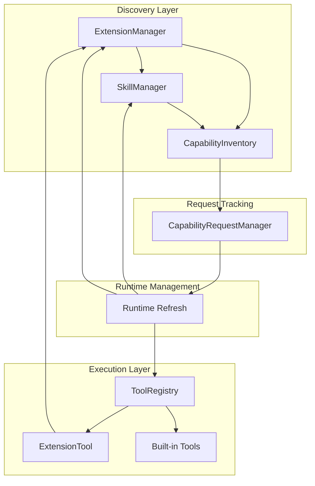
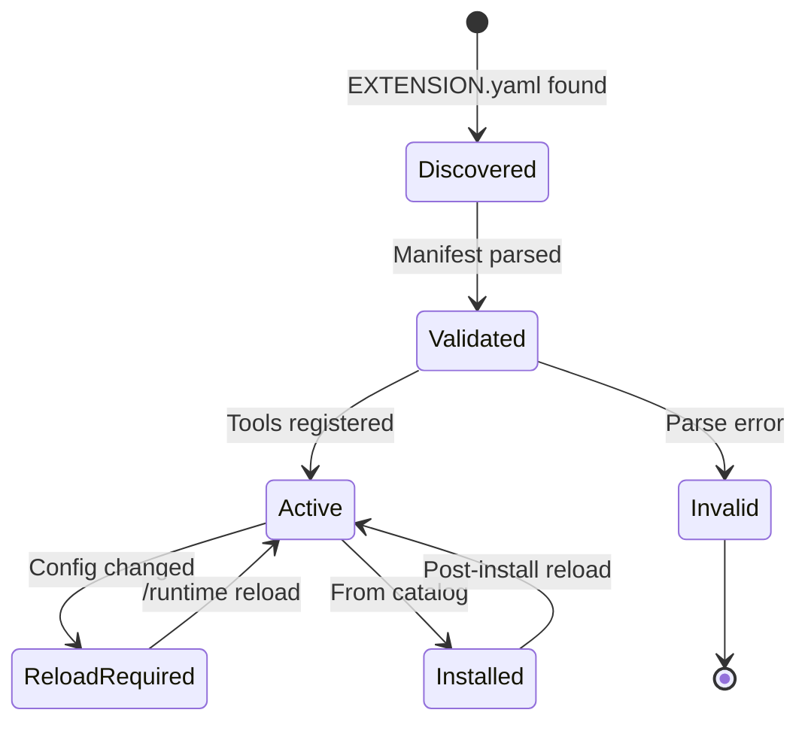
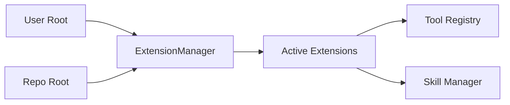
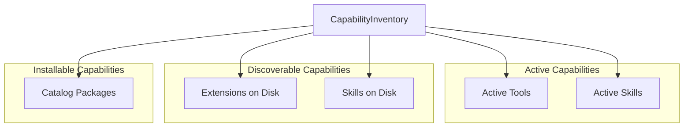
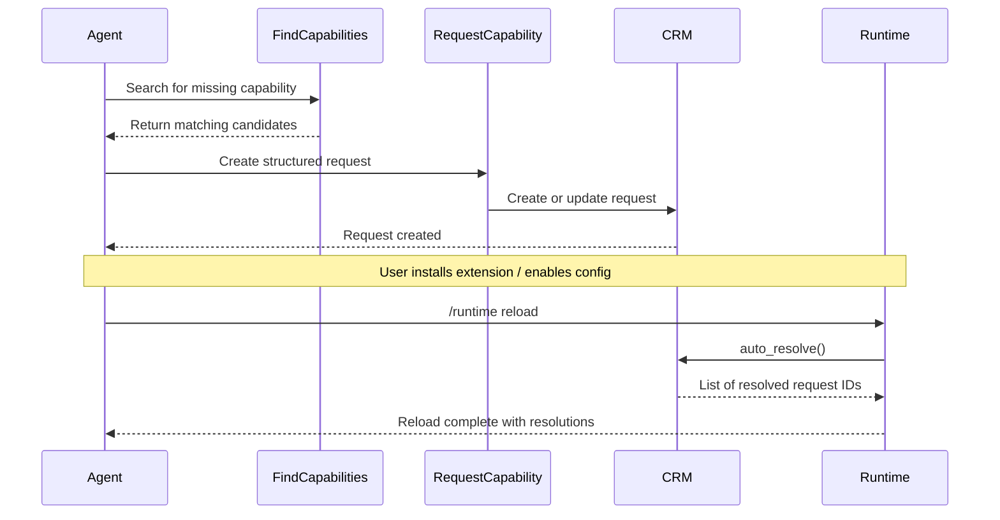
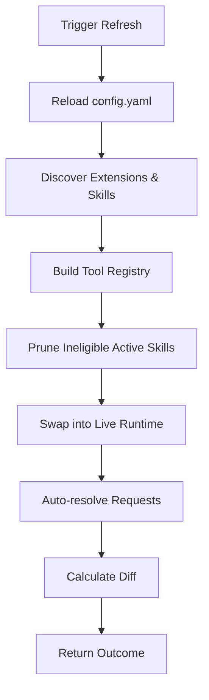
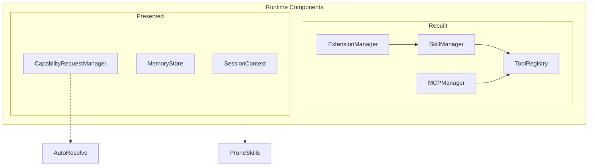
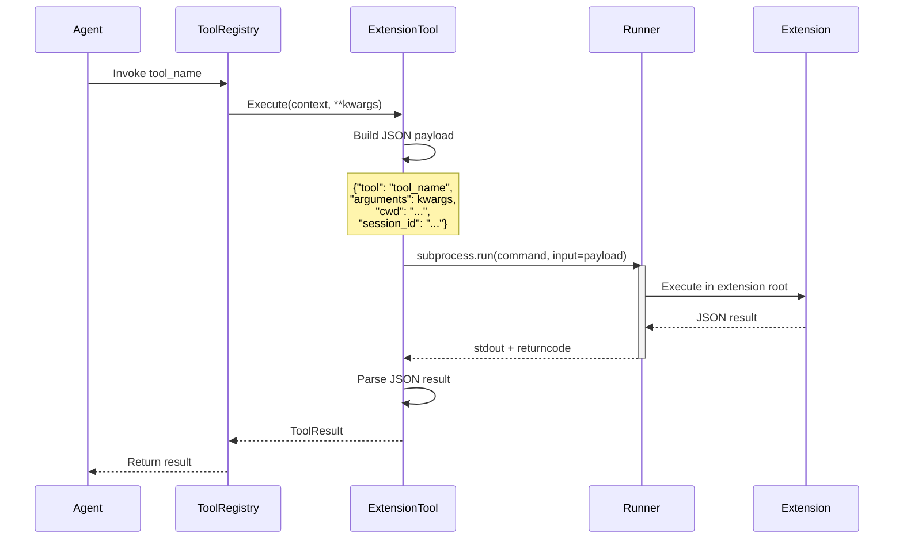
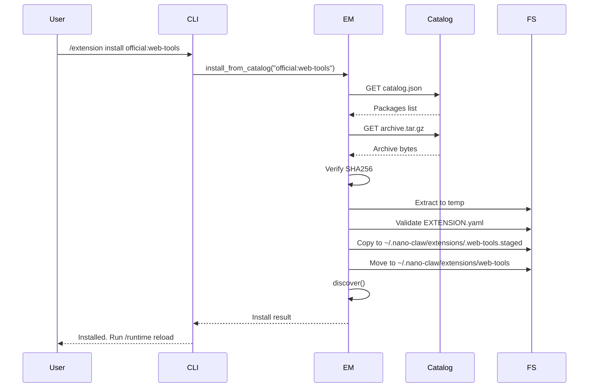
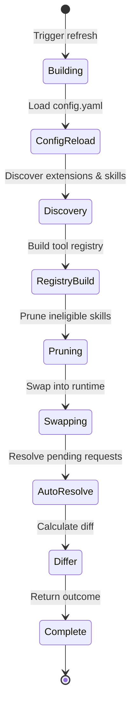

# Self-Extension Subsystem

## Abstract

The nano-claw self-extension subsystem enables runtime-discoverable tool bundles to be added, reloaded, and managed without restarting the process. This system provides a powerful plugin architecture where extensions can export tools, integrate skills, and be installed from curated catalogs—all while maintaining process isolation through out-of-process execution.

## Table of Contents

1. [Architecture Overview](#architecture-overview)
2. [Extension Bundles](#extension-bundles)
3. [Capability System](#capability-system)
4. [Runtime Refresh](#runtime-refresh)
5. [Configuration](#configuration)
6. [Execution Flow](#execution-flow)
7. [API Reference](#api-reference)
8. [Best Practices](#best-practices)

---

## Architecture Overview

The self-extension subsystem is built around several core components that work together to provide a seamless plugin experience:

### Core Components



### Design Principles

1. **Process Isolation**: Extension tools execute in separate processes via runner commands
2. **Runtime Discovery**: Extensions are discovered from user-local and repo-local roots
3. **Live Reload**: Configuration changes take effect without process restart
4. **Skill Integration**: Extensions can embed skills for automatic discovery
5. **Catalog Support**: Curated package sources enable secure extension distribution

### Extension Lifecycle



---

## Extension Bundles

### Bundle Structure

An extension bundle is a directory containing an `EXTENSION.yaml` manifest file:

```
my-extension/
├── EXTENSION.yaml          # Required manifest
├── runner.py               # Executable command
├── skills/                 # Optional embedded skills
│   └── my-extension-skill/
│       └── SKILL.md
└── lib/                    # Supporting files
    └── helper.py
```

### Manifest Format

The `EXTENSION.yaml` file declares the extension's metadata and exported tools:

```yaml
name: web-tools
version: 1.0.2
description: Web scraping and URL analysis tools
command:
  - python
  - runner.py
tools:
  - name: fetch_url
    description: Fetch content from a URL
    parameters:
      type: object
      properties:
        url:
          type: string
          description: The URL to fetch
        timeout:
          type: integer
          description: Request timeout in seconds
      required:
        - url
      additionalProperties: false
  - name: extract_links
    description: Extract all links from HTML content
    parameters:
      type: object
      properties:
        html:
          type: string
          description: HTML content to parse
      required:
        - html
      additionalProperties: false
```

### Manifest Fields

| Field | Type | Required | Description |
|-------|------|----------|-------------|
| `name` | string | Yes | Unique extension identifier |
| `version` | string | Yes | Semantic version |
| `description` | string | Yes | Human-readable description |
| `command` | list | Yes | Executable command (string or list) |
| `tools` | list | Yes | Array of tool specifications |
| `tools[].name` | string | Yes | Tool identifier (unique within extension) |
| `tools[].description` | string | Yes | Tool description |
| `tools[].parameters` | object | Yes | JSON Schema for parameters |

### Tool Specification

Each tool must declare a JSON Schema compliant parameter specification:

```yaml
parameters:
  type: object                    # Required: must be "object"
  properties:                     # Required: parameter definitions
    url:
      type: string
      description: The URL to fetch
    timeout:
      type: integer
      default: 30
  required:                       # Optional: required parameter names
    - url
  additionalProperties: false     # Optional: reject unknown parameters
```

### Skills Integration

Extensions can embed skills in a `skills/` subdirectory:

```
web-extension/
├── EXTENSION.yaml
├── runner.py
└── skills/
    └── web-scraper/
        └── SKILL.md
```

Skills are automatically discovered with the following metadata:

```yaml
# skills/web-scraper/SKILL.md
---
name: web-scraper
description: Web scraping and content extraction
---

Instructions for using the web-scraper skill...
```

The skill discovery system automatically tags these skills with extension metadata:

- `extension_name`: The parent extension name
- `extension_version`: The extension version
- `extension_install_scope`: Either "user" or "repo"

### Discovery Roots

Extensions are discovered from two configurable roots:

1. **User Root** (`~/.nano-claw/extensions`): User-local extensions shared across all repositories
2. **Repo Root** (`.nano-claw/extensions`): Repository-specific extensions



The user root takes precedence over the repo root when duplicate extension names are found.

---

## Capability System

The capability system provides a unified search interface across all available capabilities:

### Capability Types



### Availability States

| State | Description | Example |
|-------|-------------|---------|
| `active` | Currently available in the runtime | Built-in tools, loaded extensions |
| `loadable` | Discovered and eligible | Skills that can be activated |
| `reload_required` | Available on disk but not active | Newly installed extensions |
| `installable` | Available from a catalog | Packages in configured catalogs |
| `ineligible` | Cannot be loaded | Skills with unmet OS requirements |

### Search Algorithm

The capability search uses a ranked scoring system:

```python
# Exact match: score = 120
"fetch_url" == "fetch_url"

# Substring match: score = 70
"fetch" in "fetch_url"

# Token match: score = 40 + token_count
"fetch url" → "fetch_url" matches both tokens
```

Results are de-duplicated by `(kind, name, availability, package_ref)` and ranked by score.

### Capability Request Lifecycle



### Request Types

| Type | Description | Resolution Condition |
|------|-------------|---------------------|
| `reload_runtime` | Capability exists but needs reload | Tool/skill becomes active after reload |
| `install_extension` | Extension needs installation | Extension appears in extension manager |
| `enable_config` | Config flag needs enabling | Skill becomes eligible |
| `generic` | General capability request | Never auto-resolved |

### Request Deduplication

Requests are deduplicated by a normalized key:

```
reload_runtime:fetch_url
install_extension:web-tools
enable_config:macos-tools
generic:read pdf files
```

Repeated requests increment the `occurrence_count` and update the timestamp.

---

## Runtime Refresh

### Refresh Workflow



### Refresh Triggers

Runtime refresh can be triggered by:

1. **CLI Commands**: `/runtime reload` or `/extension reload`
2. **Tool Invocation**: `refresh_runtime_capabilities` tool
3. **Post-Install**: After installing from catalog
4. **Config Changes**: When `config.yaml` is modified

### What Gets Rebuilt



### State Preservation

The following state is preserved across refreshes:

- **Capability Requests**: All pending and resolved requests
- **Session Context**: Active skills (pruned if ineligible)
- **Memory Store**: File-backed session memory
- **Agent State**: Conversation history and context

### Diff Calculation

The refresh outcome includes detailed diffs:

```python
RuntimeRefreshOutcome(
    added_tools=["new_tool"],
    removed_tools=["old_tool"],
    added_skills=["new-skill"],
    removed_skills=["deprecated-skill"],
    pruned_skills=[
        {"name": "osx-only", "reason": "missing macOS"}
    ],
    resolved_capability_request_ids=["capreq_abc123"],
    warnings=["Extension 'foo' has duplicate tools"],
    extensions=[
        {"name": "web-tools", "version": "1.0.0", "source": "user"}
    ]
)
```

---

## Configuration

### Extension Configuration

```yaml
# config.yaml
extensions:
  enabled: true
  user_root: ~/.nano-claw/extensions
  repo_root: .nano-claw/extensions
  runner_timeout_seconds: 60
  install_timeout_seconds: 30
  catalogs:
    - name: official
      url: https://nano-claw.dev/extensions/catalog.json
      enabled: true
    - name: community
      url: https://github.com/nano-claw/community-extensions
      enabled: false
```

### Configuration Fields

| Field | Type | Default | Description |
|-------|------|---------|-------------|
| `enabled` | boolean | `true` | Master enable switch for extensions |
| `user_root` | string | `~/.nano-claw/extensions` | User-local extension directory |
| `repo_root` | string | `.nano-claw/extensions` | Repository-local extension directory |
| `runner_timeout_seconds` | integer | `60` | Timeout for extension tool execution |
| `install_timeout_seconds` | integer | `30` | Timeout for catalog downloads |
| `catalogs` | array | `[]` | Configured extension catalogs |

### Catalog Configuration

```yaml
catalogs:
  - name: official
    url: https://nano-claw.dev/extensions/catalog.json
    enabled: true
```

Catalog files use JSON or YAML format:

```json
{
  "packages": [
    {
      "name": "web-tools",
      "version": "1.0.0",
      "archive_url": "https://nano-claw.dev/extensions/web-tools-1.0.0.tar.gz",
      "sha256": "abc123...",
      "bundle_root": "web-tools",
      "description": "Web scraping and URL analysis tools"
    }
  ]
}
```

### Skill Eligibility

Skills can declare OS and configuration requirements:

```yaml
---
name: macos-finder
description: macOS Finder integration
requires_os: macos
requires_config:
  macos_tools:
    enabled: true
---
```

Eligibility is evaluated during skill discovery and refresh:

```python
skill.eligible  # True if all requirements met
skill.eligibility_reason  # Human-readable explanation
```

---

## Execution Flow

### Extension Tool Invocation



### JSON RPC Protocol

Extension tools communicate via JSON over stdin/stdout:

**Request Payload** (sent to runner):
```json
{
  "tool": "fetch_url",
  "arguments": {
    "url": "https://example.com",
    "timeout": 30
  },
  "cwd": "/path/to/workspace",
  "session_id": "session_abc123"
}
```

**Success Response**:
```json
{
  "success": true,
  "data": {
    "content": "<html>...</html>",
    "status_code": 200
  }
}
```

**Error Response**:
```json
{
  "success": false,
  "error": "Failed to fetch URL: connection timeout"
}
```

### Error Handling

The extension tool handles several error scenarios:

| Error Type | Handling |
|------------|----------|
| `TimeoutExpired` | Return ToolResult with timeout message |
| `OSError` | Return ToolResult with launch failure |
| `Non-zero exit` | Return stderr or generic error message |
| `No output` | Return "no JSON output" error |
| `Invalid JSON` | Return JSON decode error |
| `Missing success` | Return schema validation error |
| `False success` | Return the error message from result |

---

## API Reference

### Built-in Tools

#### find_capabilities

Search current tools, skills, discovered extensions, and configured extension catalogs.

```python
tool_result = find_capabilities(
    query="web scraping",
    limit=10
)
```

**Parameters:**
- `query` (string, required): Capability, tool, skill, or extension name to search for
- `limit` (integer, optional): Maximum number of results (1-25, default: 10)

**Returns:**
```json
{
  "query": "web scraping",
  "matches": [
    {
      "kind": "tool",
      "name": "fetch_url",
      "description": "Fetch content from a URL",
      "availability": "active",
      "tool_names": ["fetch_url"]
    },
    {
      "kind": "catalog_package",
      "name": "web-tools",
      "description": "Web scraping and URL analysis tools",
      "availability": "installable",
      "package_ref": "official:web-tools",
      "suggested_cli_actions": [
        "/extension install official:web-tools",
        "/runtime reload"
      ]
    }
  ]
}
```

#### request_capability

Record or update a missing-capability request for the current session.

```python
tool_result = request_capability(
    summary="Need PDF reading capability",
    reason="User wants to extract text from PDF documents",
    desired_capability="PDF text extraction",
    request_type="install_extension",
    package_ref="official:pdf-tools"
)
```

**Parameters:**
- `summary` (string, required): Short one-line summary
- `reason` (string, required): Why the capability is needed
- `desired_capability` (string, required): Human-readable capability name
- `request_type` (string, required): One of: `reload_runtime`, `install_extension`, `enable_config`, `generic`
- `package_ref` (string, optional): Extension package reference (`<catalog>:<package>`)
- `extension_name` (string, optional): Exact extension name
- `skill_name` (string, optional): Exact skill name
- `tool_name` (string, optional): Exact tool name

**Returns:**
```json
{
  "request_id": "capreq_abc123",
  "status": "pending",
  "request_type": "install_extension",
  "summary": "Need PDF reading capability",
  "reason": "User wants to extract text from PDF documents",
  "desired_capability": "PDF text extraction",
  "package_ref": "official:pdf-tools",
  "suggested_cli_actions": [
    "/extension install official:pdf-tools",
    "/runtime reload"
  ],
  "created_at": "2026-03-09T12:00:00Z",
  "updated_at": "2026-03-09T12:00:00Z",
  "occurrence_count": 1
}
```

#### refresh_runtime_capabilities

Reload config-backed tools and skills for the current session without restarting.

```python
tool_result = refresh_runtime_capabilities(
    reason="Installing web-tools extension"
)
```

**Parameters:**
- `reason` (string, optional): Short note explaining why the refresh is happening

**Returns:**
```json
{
  "reason": "Installing web-tools extension",
  "tool_profile": "build",
  "added_tools": ["fetch_url", "extract_links"],
  "removed_tools": [],
  "added_skills": ["web-scraper"],
  "removed_skills": [],
  "pruned_skills": [],
  "resolved_capability_request_ids": ["capreq_abc123"],
  "pending_capability_request_count": 0,
  "warnings": [],
  "extensions": [
    {
      "name": "web-tools",
      "version": "1.0.0",
      "source": "user"
    }
  ]
}
```

### Slash Commands

#### /extension

Manage extension bundles.

```
/extension                              # List all extensions
/extension show <name>                  # Show extension details
/extension install <catalog>:<package>  # Install from catalog
/extension reload                       # Reload after install
```

**Example:**
```
/extension show web-tools
/extension install official:web-tools
/extension reload
```

#### /runtime

Reload the current CLI runtime.

```
/runtime reload    # Refresh config, skills, extensions, MCP
```

**Example:**
```
/runtime reload
```

Output:
```
┏━━━━━━━━━━━━━━━━━━━━━━━━━━━━━━━━━━━━━━━━━┓
┃ Runtime Reload                          ┃
┡━━━━━━━━━━━━━━━━━━━━━━━━━━━━━━━━━━━━━━━━━┩
│ Tool profile: build                      │
│ Added tools: fetch_url, extract_links    │
│ Removed tools: none                      │
│ Added skills: web-scraper                │
│ Removed skills: none                     │
│ Resolved capability requests: capreq_abc123│
└─────────────────────────────────────────┘
```

### Python API

#### ExtensionManager

```python
from src.extensions import ExtensionManager

manager = ExtensionManager(
    repo_root=Path("/path/to/repo"),
    runtime_config=config
)

# Discover extensions
warnings = manager.discover()

# List extensions
extensions = manager.list_extensions()

# Get specific extension
extension = manager.get_extension("web-tools")

# Get tool specs
tool_specs = manager.get_tool_specs()

# Get skill roots
skill_roots = manager.get_skill_roots()

# Install from catalog
result = manager.install_from_catalog("official:web-tools")

# List catalog packages
packages = manager.list_catalog_packages()
```

#### CapabilityInventory

```python
from src.capabilities import CapabilityInventory

inventory = CapabilityInventory(
    repo_root=Path("/path/to/repo"),
    runtime_config=config
)

# Bind to live runtime
inventory.bind_runtime(
    tool_registry=tool_registry,
    skill_manager=skill_manager,
    extension_manager=extension_manager
)

# Search capabilities
results = inventory.search("web scraping", limit=10)
```

#### CapabilityRequestManager

```python
from src.capabilities import CapabilityRequestManager

manager = CapabilityRequestManager()

# Create or update request
request = manager.create_or_update(
    summary="Need PDF reading",
    reason="User wants to read PDFs",
    desired_capability="PDF text extraction",
    request_type="install_extension",
    package_ref="official:pdf-tools"
)

# List requests
pending = manager.list_requests(status="pending")

# Dismiss request
manager.dismiss_request(request.request_id)

# Auto-resolve
resolved_ids = manager.auto_resolve(
    tool_registry=tool_registry,
    skill_manager=skill_manager,
    extension_manager=extension_manager
)
```

---

## Best Practices

### Extension Design

1. **Process Isolation**: Keep extension runners stateless and idempotent
2. **Error Messages**: Return clear, actionable error messages in JSON responses
3. **Timeout Handling**: Respect configured timeouts and fail gracefully
4. **Resource Cleanup**: Clean up temporary files and connections
5. **Version Management**: Use semantic versioning for compatibility tracking

### Manifest Design

1. **Tool Naming**: Use descriptive, action-oriented tool names (`fetch_url`, not `url`)
2. **Parameter Validation**: Use JSON Schema for strict parameter validation
3. **Description Quality**: Write clear, concise descriptions for tools and parameters
4. **Default Values**: Provide sensible defaults for optional parameters
5. **Required Parameters**: Minimize required parameters for better usability

### Error Handling

1. **Structured Errors**: Always return errors with context and suggested actions
2. **Timeout Messages**: Include the timeout duration in timeout errors
3. **Validation Errors**: Explain what failed validation and why
4. **Recovery Hints**: Suggest CLI commands or configuration changes

### Security Considerations

1. **Archive Validation**: Verify SHA256 hashes before extraction
2. **Path Sanitization**: Prevent directory traversal attacks in archives
3. **Command Validation**: Normalize and validate runner commands
4. **Timeout Enforcement**: Prevent runaway extension processes
5. **User Consent**: Require explicit installation from catalogs

### Performance Optimization

1. **Lazy Loading**: Discover extensions on-demand, not at startup
2. **Caching**: Cache catalog packages to avoid repeated HTTP requests
3. **Parallel Discovery**: Scan user and repo roots in parallel
4. **Incremental Refresh**: Only reload changed components
5. **Skill Pruning**: Remove ineligible skills from active set

### Testing Extensions

1. **Unit Tests**: Test runner logic in isolation
2. **Integration Tests**: Test extension tool invocation
3. **Timeout Tests**: Verify timeout handling
4. **Error Scenarios**: Test malformed JSON, timeouts, and crashes
5. **Manifest Validation**: Test with invalid manifests

### Example Extension

```python
# runner.py
import json
import sys
from typing import Any

def main():
    # Parse request
    payload = json.loads(sys.stdin.read())
    tool = payload["tool"]
    args = payload.get("arguments", {})

    try:
        # Execute tool logic
        if tool == "fetch_url":
            result = fetch_url(args["url"])
            print(json.dumps({"success": True, "data": result}))
        else:
            print(json.dumps({"success": False, "error": f"Unknown tool: {tool}"}))
    except Exception as e:
        print(json.dumps({"success": False, "error": str(e)}))

def fetch_url(url: str) -> dict[str, Any]:
    # Implementation here
    return {"content": "...", "status_code": 200}

if __name__ == "__main__":
    main()
```

```yaml
# EXTENSION.yaml
name: example-extension
version: 1.0.0
description: Example extension for demonstration
command:
  - python
  - runner.py
tools:
  - name: fetch_url
    description: Fetch content from a URL
    parameters:
      type: object
      properties:
        url:
          type: string
          description: The URL to fetch
      required:
        - url
      additionalProperties: false
```

---

## References

### Core Modules

- `src/extensions.py` - Extension discovery and installation
- `src/capabilities.py` - Capability search and request tracking
- `src/tools/extension.py` - Out-of-process tool execution
- `src/tools/capability.py` - Built-in capability tools
- `src/tools/runtime_refresh.py` - Runtime refresh tool
- `src/runtime_refresh.py` - Live runtime rebuilding
- `src/commands/runtime_cmds.py` - `/runtime` CLI command
- `src/commands/extension_cmds.py` - `/extension` CLI command
- `src/config.py` - Extension and catalog configuration

### Related Documentation

- [Skills System](./skills.md) - Skill discovery and activation
- [Tool Registry](./tools.md) - Tool registration and invocation
- [Configuration](./configuration.md) - Complete configuration reference
- [MCP Integration](./mcp.md) - Model Context Protocol server integration

---

## Appendix

### Example Catalog Entry

```json
{
  "name": "web-tools",
  "version": "1.0.0",
  "archive_url": "https://github.com/nano-claw/web-tools/archive/v1.0.0.tar.gz",
  "sha256": "a1b2c3d4e5f6...",
  "bundle_root": "web-tools-1.0.0",
  "description": "Web scraping and URL analysis tools including fetch_url, extract_links, and analyze_html"
}
```

### Capability Scoring Algorithm

```python
def score_match(query: str, *fields: str) -> int:
    """Score a capability match (0-120)."""
    score = 0
    for field in fields:
        normalized = normalize_capability_text(field)
        if normalized == query:
            score = max(score, 120)  # Exact match
        elif query in normalized:
            score = max(score, 70)   # Substring match
        else:
            query_tokens = query.split()
            if all(token in normalized for token in query_tokens):
                score = max(score, 40 + len(query_tokens))  # Token match
    return score
```

### Extension Install Sequence



### Runtime Refresh State Diagram



---

*Document Version: 1.0.0*
*Last Updated: 2026-03-09*
*Maintained by: nano-claw development team*
