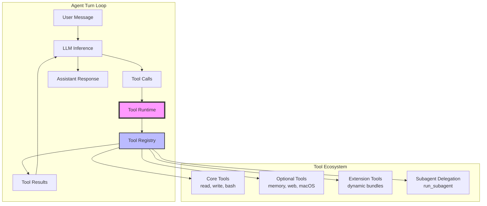
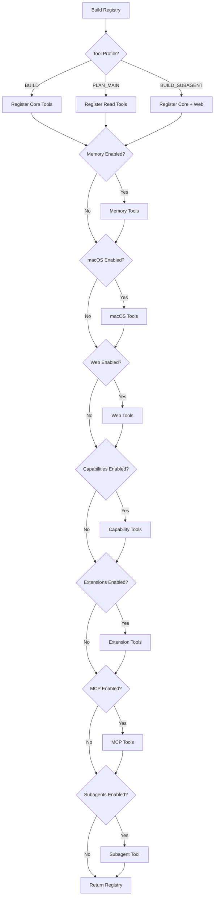
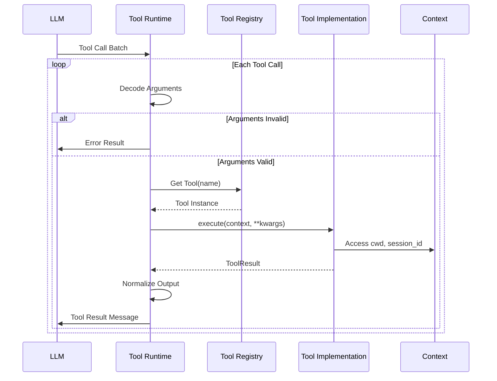

# Tool Subsystem Architecture

## Abstract

The Tool subsystem is the extensibility layer of nano-claw that enables AI agents to interact with external systems, execute commands, manipulate files, and delegate work to specialized sub-agents. This document provides a comprehensive technical overview of the Tool architecture, execution workflow, built-in tools, and best practices for tool development.

## Table of Contents

1. [Architecture Overview](#architecture-overview)
2. [Core Abstractions](#core-abstractions)
3. [Tool Registration and Discovery](#tool-registration-and-discovery)
4. [Execution Workflow](#execution-workflow)
5. [Built-in Tools](#built-in-tools)
6. [Design Patterns and Best Practices](#design-patterns-and-best-practices)
7. [Error Handling and Fault Tolerance](#error-handling-and-fault-tolerance)
8. [Performance Considerations](#performance-considerations)

---

## Architecture Overview

### Why Tools Exist

The Tool subsystem addresses a fundamental challenge in AI agent architecture: how to give language models bounded, structured access to external capabilities. Tools provide:

- **Capability Extension**: Allow agents to perform actions beyond text generation (file I/O, web requests, command execution)
- **Safety Boundaries**: Limit what agents can do through explicit parameter schemas and validation
- **Composability**: Enable complex workflows through tool composition and delegation
- **Observability**: Make all external actions explicit and loggable
- **Extensibility**: Allow new capabilities to be added without core system changes

### System Context

The Tool subsystem operates at the heart of the agent turn loop:



### Tool Profiles

Tools are organized into **profiles** that control which tools are available in different execution contexts:

| Profile | Purpose | Tools Available |
|---------|---------|-----------------|
| `BUILD` | Normal agent operation | All core + optional tools |
| `BUILD_SUBAGENT` | Subagent execution | Core + web + MCP + extensions |
| `PLAN_MAIN` | Planning mode (main agent) | Read-only + planning + web + capabilities |
| `PLAN_SUBAGENT` | Planning mode (subagent) | Read-only only |

This profile system enables the same agent code to operate safely in different contexts with appropriate capability boundaries.

---

## Core Abstractions

### Tool Base Class

All tools inherit from the `Tool` base class, which provides the fundamental contract:

```python
class Tool:
    """Base class for all agent tools."""

    name: str = ""                    # Unique tool identifier
    description: str = ""             # OpenAI function calling description
    parameters: dict = field(default_factory=dict)  # JSON Schema for parameters

    def execute(self, context: "Context", **kwargs) -> ToolResult:
        """Execute the tool with given arguments."""
        raise NotImplementedError(f"{self.__class__.__name__}.execute() not implemented")

    def _require_param(self, kwargs: dict, name: str) -> Any:
        """Get a required parameter or raise ValueError."""
        value = kwargs.get(name)
        if not value:
            raise ValueError(f"{name} is required")
        return value

    def _resolve_path(self, context: "Context", file_path: str) -> Path:
        """Resolve a file path relative to the current working directory."""
        return context.cwd / file_path

    def to_schema(self) -> Dict:
        """Convert tool to OpenAI function calling schema."""
        return {
            "type": "function",
            "function": {
                "name": self.name,
                "description": self.description,
                "parameters": self.parameters,
            },
        }
```

**Key Design Decisions:**

1. **Stateless Execution**: Tools receive context at execution time, not construction, enabling reuse
2. **Explicit Parameters**: All parameters are declared as JSON Schema for validation
3. **Path Resolution**: File paths are resolved relative to context working directory
4. **Schema Generation**: Tools auto-generate OpenAI function calling schemas

### Tool Result

The `ToolResult` dataclass provides a standardized return type:

```python
@dataclass
class ToolResult:
    """Standardized tool output."""

    success: bool                      # Execution outcome
    data: Optional[Any] = None         # Result payload on success
    error: Optional[str] = None        # Error message on failure
    meta: Optional[dict[str, Any]] = None  # Optional metadata
```

**Result Patterns:**

- **Success**: `success=True`, `data=<result>`, `error=None`
- **Failure**: `success=False`, `error=<message>`, `data=None`
- **With Metadata**: `meta` can include hints, capability suggestions, or debugging info

### Context Object

The `Context` object provides session-scoped state to all tools:

```python
@dataclass
class Context:
    """Session context passed to all operations."""
    cwd: Path                                  # Current working directory
    session_id: str = field(default_factory=lambda: str(uuid.uuid4()))
    messages: List[ChatMessage] = field(default_factory=list)
    active_skills: List[str] = field(default_factory=list)
    session_mode: SessionMode = "build"        # "build" or "plan"
    current_plan: SessionPlan | None = None    # Active plan in planning mode
```

---

## Tool Registration and Discovery

### Tool Registry

The `ToolRegistry` manages tool lifecycle:

```python
class ToolRegistry:
    """Register and manage available tools."""

    def __init__(self):
        self._tools: Dict[str, Tool] = {}

    def register(self, tool: Tool) -> None:
        """Register a tool."""
        self._tools[tool.name] = tool

    def get(self, name: str) -> Optional[Tool]:
        """Get a tool by name."""
        return self._tools.get(name)

    def get_tool_schemas(self) -> List[Dict]:
        """Get all tools as OpenAI function schemas."""
        return [tool.to_schema() for tool in self._tools.values()]

    def list_tools(self) -> List[str]:
        """List all registered tool names."""
        return list(self._tools.keys())
```

### Registry Building

The `build_tool_registry_with_report()` function is the primary factory:



**Conditional Registration Logic:**

Each optional tool group is registered based on:

1. **Tool Profile**: Some tools only available in certain profiles
2. **Configuration**: Runtime config flags (e.g., `memory.enabled`)
3. **Platform**: Platform-specific tools (e.g., macOS tools require `darwin`)
4. **Dependency Availability**: Managers must be available (e.g., `memory_store`)

### Debug Reporting

The `ToolRegistryReport` provides structured debug output:

```python
@dataclass(frozen=True)
class ToolRegistryReport:
    """Structured report describing how optional tool registration resolved."""

    tool_profile: ToolProfile
    platform: str
    registered_tool_names: tuple[str, ...]
    group_decisions: tuple[ToolRegistrationDecision, ...]
    tool_decisions: tuple[ToolRegistrationDecision, ...]
```

This enables precise debugging of why tools were or weren't registered.

---

## Execution Workflow

### Tool Runtime

The `AgentToolRuntime` class orchestrates tool execution:



### Execution Flow

1. **Tool Call Reception**: Runtime receives tool calls from LLM response
2. **Argument Decoding**: JSON arguments are parsed and validated
3. **Tool Lookup**: Tool instance retrieved from registry
4. **Context Injection**: Current context passed to tool
5. **Execution**: Tool `execute()` method runs with parameters
6. **Result Normalization**: Output converted to safe JSON format
7. **Message Construction**: Tool result formatted as chat message
8. **Logging**: All calls and results logged for debugging

### Special Tool Handling

#### Subagent Batching

The `run_subagent` tool uses special batch processing:

```python
def process_subagent_batch(
    self,
    tool_calls: List[ToolCallPayload],
    *,
    messages: List[ChatMessage],
    turn_id: int,
    iteration: int,
    on_tool_call: Optional[Callable],
    on_event,
    tools_used: Optional[List[str]],
) -> int:
    """Process one consecutive run_subagent batch with per-turn-capped fan-out."""
```

**Why Batch Subagents?**

- **Parallel Execution**: Multiple subagents can run concurrently
- **Efficiency**: Single pass over tool call list
- **Turn-level Capping**: Limits total subagents per turn for safety

#### Control Plane Tools

Some tools (`submit_plan`, `load_skill`) have special execution paths:

- **`submit_plan`**: Can terminate turn early with plan report
- **`load_skill`**: Emits skill-specific events and updates context
- **`run_subagent`**: Never actually executes via standard path

### Error Handling

The runtime provides comprehensive error handling:

```python
def execute_standard_tool_call(
    self,
    tool_call: ToolCallPayload,
    parsed_args: Dict[str, Any],
) -> tuple[ChatMessage, ToolResultPayload]:
    """Execute one ordinary tool call and build the tool-result message."""
    tool_name = tool_call["name"]
    tool_id = tool_call["id"]

    try:
        tool = self.get_tool(tool_name)
        if not tool:
            result = {
                "error": f"Unknown tool: {tool_name}",
                "capability_hint": build_capability_hint(
                    query=tool_name,
                    message=f"Tool '{tool_name}' is not available in this session.",
                    kind="tool",
                    name=tool_name,
                ),
            }
        else:
            result_obj = tool.execute(self.context, **parsed_args)
            if result_obj.success:
                result = {"output": self._normalize_tool_output(result_obj.data)}
            else:
                result = {"error": result_obj.error or "Tool execution failed"}
            if result_obj.meta:
                result.update(result_obj.meta)
    except json.JSONDecodeError:
        result = {"error": f"Invalid JSON in tool arguments: {tool_call['arguments']}"}
    except Exception as exc:
        result = {"error": f"Error executing tool: {exc}"}

    return self.build_tool_result_message(tool_id, result), result
```

**Error Categories:**

1. **Unknown Tool**: Tool not in registry → capability hint
2. **JSON Decode Error**: Invalid arguments → clear error message
3. **Execution Error**: Tool raised exception → wrapped error
4. **Tool-reported Failure**: Tool returned `success=False` → error propagated

---

## Built-in Tools

### Core Tools

Always available in all profiles.

#### ReadTool (`read_file`)

**Purpose**: Read file contents with line numbers.

**Parameters:**
```json
{
  "type": "object",
  "properties": {
    "file_path": {
      "type": "string",
      "description": "Path to the file (relative to current working directory or absolute)"
    }
  },
  "required": ["file_path"]
}
```

**Returns**: File contents with line numbers prefixed.

**Example:**
```python
# Agent call
read_file(file_path="src/main.py")

# Tool result
ToolResult(success=True, data="   1    '''Main entry point.'''\n   2    from src.tools import ...\n...")
```

**Design Notes:**
- Line numbers help agents reference specific lines in responses
- Relative paths resolved to context working directory
- Fails gracefully for directories, permissions, missing files

#### WriteTool (`write_file`)

**Purpose**: Create or overwrite files.

**Parameters:**
```json
{
  "type": "object",
  "properties": {
    "file_path": {
      "type": "string",
      "description": "Path to the file"
    },
    "content": {
      "type": "string",
      "description": "Full file content to write"
    }
  },
  "required": ["file_path", "content"]
}
```

**Design Notes:**
- Creates parent directories automatically
- Complete overwrite (no append)
- No partial writes or atomicity guarantees
- Used for both creating new files and replacing existing

#### BashTool (`run_command`)

**Purpose**: Execute shell commands.

**Parameters:**
```json
{
  "type": "object",
  "properties": {
    "command": {
      "type": "string",
      "description": "Shell command to execute"
    }
  },
  "required": ["command"]
}
```

**Returns**: STDOUT and STDERR separated, with exit code.

**Design Notes:**
- 30-second timeout default
- Runs via `shell=True` for pipes and redirects
- Working directory set to context.cwd
- Exit code 0 = success, non-zero = failure

**Safety Considerations:**
- Only available in BUILD and BUILD_SUBAGENT profiles
- Not available in planning mode (use `run_readonly_command` instead)
- Full shell access means agents can delete, modify, network access

#### LoadSkillTool (`load_skill`)

**Purpose**: Load a skill's full instructions into current turn.

**Parameters:**
```json
{
  "type": "object",
  "properties": {
    "skill_name": {
      "type": "string",
      "description": "Name of the skill to load"
    }
  },
  "required": ["skill_name"]
}
```

**Design Notes:**
- Skills are pre-prompt bundles with instructions
- Loading injects skill text into next LLM call
- Emits skill-specific events for tracking
- Provides capability hints if skill unknown

### Optional Tool Groups

#### Memory Tools

Available when memory system is enabled in BUILD profile.

**Tools:**
- `memory_read`: Inspect memory workspace (curated, sections, entries, daily logs)
- `memory_search`: Search memory with semantic query
- `memory_write`: Mutate memory (upsert, update, archive, supersede, delete, append)

**Architecture:**
```python
class MemoryReadTool(Tool):
    """Read curated or daily Markdown memory for the current session."""

    def __init__(self, memory_store: SessionMemory) -> None:
        self.memory_store = memory_store
```

Memory tools delegate to `SessionMemory` subsystem for actual persistence.

**Key Patterns:**
- **Search-first**: Use `memory_search` before asking user repeated questions
- **Structured**: Curated memory has kinds (fact, decision, task, note)
- **Lifecycle**: Entries can be archived, superseded, or deleted
- **Dual Storage**: Curated (durable) + daily (temporary) logs

#### Web Tools

Available in BUILD, BUILD_SUBAGENT, and PLAN_MAIN profiles when enabled.

**Tools:**
- `fetch_url`: Raw HTTP fetch with text decoding
- `read_webpage`: Extract readable article text + metadata
- `extract_page_links`: Scrape links from HTML

**Shared Infrastructure:**
```python
@dataclass
class WebClient:
    """HTTP helper with public-network guardrails and lightweight HTML parsing."""

    timeout_seconds: int = 15
    max_response_bytes: int = 2_000_000
    max_content_chars: int = 20_000
    allow_private_networks: bool = False
```

**Safety Features:**
- Private network blocking (localhost, 10.x.x.x, 192.168.x.x, etc.)
- Size limits (bytes and chars)
- Timeout protection
- Content-type validation
- Redirect following (max 5)

**HTML Parsing:**
- Strips scripts, styles, nav, footer, aside, form
- Extracts title, site_name, published_at, excerpt
- Falls back to regex if BeautifulSoup unavailable

#### macOS Tools

Available only on `darwin` platform when enabled.

**Tools:**
- `finder_action`: File system operations (list, open, reveal, create folder, rename)
- `calendar_action`: Calendar management (list calendars/events, create/update events)
- `notes_action`: Notes.app access (list, read, create, update notes)
- `reminders_action`: Reminders management (lists, reminders, complete)
- `messages_action`: Messages.app read-only (list chats, read messages)

**Architecture:**
```python
@dataclass
class MacOSHelper:
    """Execute the shared JXA helper and normalize its output."""

    timeout_seconds: int = 10
    script_path: Path | None = None

    def execute(self, *, app: str, action: str, arguments: dict[str, Any]) -> Any:
```

**Implementation:**
- Single JXA (JavaScript for Automation) helper script
- JSON-over-stdin protocol
- Structured error mapping (permissions vs generic failures)
- Permission detection with helpful messages

**Safety:**
- macOS Automation permissions required
- Explicit action enums limit operations
- No arbitrary AppleScript execution
- Input validation (dates, booleans, integers)

#### Capability Tools

Available in BUILD and PLAN_MAIN profiles.

**Tools:**
- `find_capabilities`: Search tools, skills, extensions, catalogs
- `request_capability`: Record missing capability requests

**Purpose:** Help agents discover what's available and request missing capabilities.

**Workflow:**
1. Agent needs capability but doesn't know exact name
2. Agent calls `find_capabilities(query="database")`
3. Returns matching tools, skills, extensions, catalog packages
4. Agent chooses capability or calls `request_capability`

#### Extension Tools

Dynamically loaded from extension bundles when enabled.

**Architecture:**
```python
class ExtensionTool(Tool):
    """Invoke one extension-defined tool via the bundle runner command."""

    def __init__(
        self,
        extension: ExtensionSpec,
        tool_spec: ExtensionToolSpec,
        *,
        timeout_seconds: int,
    ) -> None:
```

**Execution Model:**
- Out-of-process: Each tool is a subprocess
- JSON-over-stdin protocol
- Tool specification from extension manifest
- Timeout protection per-tool

**Protocol:**
```json
// Input (stdin)
{
  "tool": "my_tool",
  "arguments": {"param": "value"},
  "cwd": "/path/to/dir",
  "session_id": "uuid"
}

// Output (stdout)
{
  "success": true,
  "data": {"result": "value"}
}
```

**Advantages:**
- Language-agnostic: Any language can implement tools
- Isolation: Crashes don't bring down agent
- Distribution: Extensions can be installed separately

#### Subagent Tool (`run_subagent`)

Available in BUILD and PLAN_MAIN profiles when subagents enabled.

**Parameters:**
```json
{
  "type": "object",
  "properties": {
    "task": {
      "type": "string",
      "description": "Delegated task for the child agent."
    },
    "label": {
      "type": "string",
      "description": "Optional short label for the subagent run."
    },
    "context": {
      "type": "string",
      "description": "Optional extra parent context for the delegated task."
    },
    "success_criteria": {
      "type": "string",
      "description": "Optional completion contract for the child."
    },
    "files": {
      "type": "array",
      "items": {"type": "string"},
      "description": "Optional file hints."
    },
    "output_hint": {
      "type": "string",
      "description": "Optional hint about the desired report format."
    }
  },
  "required": ["task"]
}
```

**Special Execution:**
- Never executes via standard tool path
- Runtime intercepts and batches consecutive calls
- Subagents run in parallel with capped fan-out
- Results returned as structured reports

**Use Cases:**
- Independent investigations (e.g., "check if tests pass")
- Parallelizable work (e.g., "read these 5 files")
- Isolated failures (subagent crashes don't stop parent)

### Planning Mode Tools

Available only in PLAN_MAIN profile.

#### ReadOnlyShellTool (`run_readonly_command`)

**Purpose:** Safe repository inspection in planning mode.

**Allowlist:**
- `rg`, `ls`, `find` (unrestricted)
- `git` (subcommands: `status`, `diff`, `grep`, `show`, `log`)

**Parameters:**
```json
{
  "type": "object",
  "properties": {
    "argv": {
      "type": "array",
      "items": {"type": "string"},
      "description": "Command argv to run without shell expansion."
    }
  },
  "required": ["argv"]
}
```

**Safety:**
- No shell execution (argv form only)
- Explicit command allowlist
- Git subcommand allowlist
- No writes, no network, no file modification

#### WritePlanTool (`write_plan`)

**Purpose:** Write the canonical session plan artifact.

**Parameters:**
```json
{
  "type": "object",
  "properties": {
    "content": {
      "type": "string",
      "description": "Full Markdown content for the canonical plan file."
    }
  },
  "required": ["content"]
}
```

**Behavior:**
- Writes to session-specific plan file
- Updates context.current_plan
- Triggers plan_written event
- File path is deterministic (not user-controlled)

#### SubmitPlanTool (`submit_plan`)

**Purpose:** Finalize plan and submit for user review.

**Parameters:**
```json
{
  "type": "object",
  "properties": {
    "summary": {
      "type": "string",
      "description": "Short summary of the proposed plan."
    },
    "report": {
      "type": "string",
      "description": "Human-facing planning report to show before approval."
    }
  },
  "required": ["summary", "report"]
}
```

**Behavior:**
- Validates plan file exists and is non-empty
- Marks plan as "ready_for_review"
- Stores summary and report
- Can terminate turn early with plan report

---

## Design Patterns and Best Practices

### Tool Implementation Patterns

#### 1. Parameter Validation Helper

```python
def _require_string(kwargs: dict[str, Any], name: str) -> str:
    value = kwargs.get(name)
    if not isinstance(value, str) or not value.strip():
        raise ValueError(f"{name} is required")
    return value.strip()

def _optional_string(kwargs: dict[str, Any], name: str) -> str | None:
    value = kwargs.get(name)
    if value is None:
        return None
    if not isinstance(value, str):
        raise ValueError(f"{name} must be a string")
    stripped = value.strip()
    return stripped or None
```

**Benefits:**
- Consistent error messages
- Type checking
- Whitespace trimming
- Optional vs required distinction

#### 2. Shared Client Injection

```python
class MacOSActionTool(Tool):
    def __init__(self, helper: MacOSHelper) -> None:
        self.helper = helper

    def execute(self, context, **kwargs) -> ToolResult:
        # Use self.helper.execute()
```

**Benefits:**
- Shared state (connections, processes)
- Consistent configuration
- Easier testing (mock injection)
- Resource efficiency

#### 3. Action-based Polymorphism

```python
class CalendarActionTool(Tool):
    def execute(self, context, **kwargs) -> ToolResult:
        action = _require_string(kwargs, "action")
        arguments = self._build_arguments(action, kwargs)
        data = self.helper.execute(app="calendar", action=action, arguments=arguments)
        return ToolResult(success=True, data=data)

    def _build_arguments(self, action: str, kwargs: dict[str, Any]) -> dict[str, Any]:
        if action == "list_calendars":
            return {}
        if action == "list_events":
            return {...}
        # ...
        raise ValueError(f"Unsupported calendar action: {action}")
```

**Benefits:**
- One tool, multiple operations
- Shared validation and infrastructure
- Consistent error handling
- Enum-based documentation

#### 4. Structured Error Types

```python
class WebToolError(Exception):
    """Base failure for public-web tools."""

class WebAccessError(WebToolError):
    """Blocked or invalid target error."""

class WebContentError(WebToolError):
    """Unsupported or malformed content error."""
```

**Benefits:**
- Catchable error categories
- Different retry strategies
- Clear error types in logs
- User-friendly messages

### Extensibility Patterns

#### Adding a New Tool

1. **Create tool class:**

```python
from src.tools import Tool, ToolResult

class MyTool(Tool):
    name = "my_tool"
    description = "Does something useful"
    parameters = {
        "type": "object",
        "properties": {
            "param": {"type": "string", "description": "A parameter"}
        },
        "required": ["param"]
    }

    def execute(self, context, **kwargs) -> ToolResult:
        try:
            param = self._require_param(kwargs, "param")
            # Do work
            return ToolResult(success=True, data="result")
        except Exception as e:
            return ToolResult(success=False, error=str(e))
```

2. **Register in build_tool_registry:**

```python
def build_tool_registry_with_report(...) -> tuple[ToolRegistry, ToolRegistryReport]:
    # ...
    if tool_profile == ToolProfile.BUILD:
        registry.register(MyTool())
```

3. **Add tests:**

```python
def test_my_tool_success():
    tool = MyTool()
    context = Context.create(cwd="/tmp")
    result = tool.execute(context, param="test")
    assert result.success
    assert result.data == "result"
```

#### Adding a New Optional Tool Group

1. **Create config section:**

```python
@dataclass
class RuntimeConfig:
    my_tools: MyToolsConfig = field(default_factory=MyToolsConfig)

@dataclass
class MyToolsConfig:
    enabled: bool = False
    enable_my_tool: bool = False
    timeout_seconds: int = 10
```

2. **Add to build plan:**

```python
def _build_optional_tool_plan(...) -> _ToolBuildPlan:
    # ...
    my_tool_flags = {
        "my_tool": runtime_config.my_tools.enable_my_tool,
    }
    if tool_profile != ToolProfile.BUILD:
        reason = _profile_reason(tool_profile, "build")
        plan.group_decisions.append(_skipped("my_tools", reason))
    elif not runtime_config.my_tools.enabled:
        reason = "my_tools.enabled is false"
        plan.group_decisions.append(_skipped("my_tools", reason))
    else:
        if my_tool_flags["my_tool"]:
            plan.register_my_tool = True
            plan.tool_decisions.append(_registered("my_tool"))
```

3. **Register conditionally:**

```python
if plan.register_my_tool:
    client = MyClient(timeout=runtime_config.my_tools.timeout_seconds)
    registry.register(MyTool(client))
```

### Testing Patterns

#### Unit Test Structure

```python
import pytest
from src.tools import Tool, ToolResult, Context

class TestMyTool:
    def test_success(self):
        tool = MyTool()
        context = Context.create(cwd="/tmp")
        result = tool.execute(context, param="valid")
        assert result.success
        assert result.data == "expected"

    def test_missing_param(self):
        tool = MyTool()
        context = Context.create(cwd="/tmp")
        result = tool.execute(context)
        assert not result.success
        assert "required" in result.error.lower()

    def test_exception_handling(self):
        tool = MyTool()
        context = Context.create(cwd="/nonexistent")
        result = tool.execute(context, param="invalid")
        assert not result.success
        assert result.error is not None
```

#### Integration Testing

```python
def test_tool_in_registry():
    registry = build_tool_registry(
        tool_profile=ToolProfile.BUILD,
        runtime_config=config,
        # ... other managers
    )
    tool = registry.get("my_tool")
    assert tool is not None
    assert tool.name == "my_tool"
```

---

## Error Handling and Fault Tolerance

### Error Categories

#### 1. Validation Errors

**When:** Argument parsing, before tool execution

**Handling:**
```python
try:
    param = self._require_param(kwargs, "param")
except ValueError as e:
    return ToolResult(success=False, error=str(e))
```

**Characteristics:**
- Immediate failure
- Clear error messages
- No side effects
- No retry needed (user error)

#### 2. Execution Errors

**When:** Tool execution fails

**Handling:**
```python
try:
    result = subprocess.run(...)
except subprocess.TimeoutExpired:
    return ToolResult(success=False, error="Command timed out")
except Exception as e:
    return ToolResult(success=False, error=f"Error: {e}")
```

**Characteristics:**
- May be transient (timeout, network)
- May be permanent (permissions, missing file)
- Partial state possible
- Retry sometimes appropriate

#### 3. System Errors

**When:** Tool lookup, JSON parsing, runtime errors

**Handling:**
```python
try:
    tool = self.get_tool(tool_name)
    if not tool:
        result = {
            "error": f"Unknown tool: {tool_name}",
            "capability_hint": build_capability_hint(...)
        }
except json.JSONDecodeError:
    result = {"error": f"Invalid JSON: {tool_call['arguments']}"}
```

**Characteristics:**
- Never tool's fault
- Capability hints helpful
- No retry (configuration issue)

### Fault Tolerance Strategies

#### 1. Timeout Protection

```python
# Bash tool
DEFAULT_TIMEOUT = 30

result = subprocess.run(
    command,
    timeout=self.DEFAULT_TIMEOUT,
    # ...
)

# Web tool
timeout_seconds: int = 15

with self.client.stream("GET", url) as response:
    # ... (httpx handles timeout)
```

**Why:** Prevent hangs from unresponsive commands or network.

#### 2. Size Limits

```python
# Web client
max_response_bytes: int = 2_000_000
max_content_chars: int = 20_000

if len(body) > self.max_response_bytes:
    raise WebContentError(f"Response exceeds max_response_bytes")

response_text, truncated = _truncate_text(decoded, max_chars)
```

**Why:** Prevent memory exhaustion and token limit issues.

#### 3. Resource Isolation

```python
# Extension tools run in subprocess
completed = subprocess.run(
    list(self.extension.command),
    input=json.dumps(payload),
    timeout=self._timeout_seconds,
    check=False,
)
```

**Why:** Extension crashes don't bring down agent.

#### 4. Validation Gates

```python
# Read-only shell tool
_ALLOWED_COMMANDS = {"rg", "ls", "find", "git"}
_ALLOWED_GIT_SUBCOMMANDS = {"status", "diff", "grep", "show", "log"}

if command not in _ALLOWED_COMMANDS:
    raise ValueError(f"Command not allowed in planning mode: {command}")
```

**Why:** Explicit safety boundaries in restricted contexts.

### Error Recovery

#### Agent-Level

Agents see tool failures in response and can:

1. **Retry with different parameters**
2. **Try alternative tool**
3. **Ask user for help**
4. **Report failure and continue**

#### System-Level

Runtime ensures:

1. **All tool calls get responses** (no hanging)
2. **Errors are logged** for debugging
3. **Turn can continue** after failure
4. **Partial results preserved** (batch processing)

---

## Performance Considerations

### Tool Execution Overhead

#### Per-Call Overhead

- **JSON parsing**: ~0.1ms per call
- **Tool lookup**: ~0.01ms (dict lookup)
- **Context injection**: ~0.001ms (reference)
- **Result normalization**: ~0.1ms (JSON check)

**Total:** <1ms overhead per call (excluding tool execution time)

#### Subagent Batching

Without batching:
```
5 subagents × 5s each = 25s serial
```

With batching:
```
5 subagents in parallel = 5s total
```

**Improvement:** 5x speedup for parallelizable work.

### Resource Management

#### Connection Pooling

```python
# WebClient reuses HTTP connection
@dataclass
class WebClient:
    client: httpx.Client | None = None

    def __post_init__(self) -> None:
        if self.client is None:
            self.client = httpx.Client(...)  # Connection pool
```

**Benefits:**
- Reuses TCP connections
- Reduces latency
- Handles HTTP/2 multiplexing

#### Process Management

```python
# macOS tools share single helper
helper = MacOSHelper(timeout_seconds=10)
registry.register(FinderActionTool(helper))
registry.register(CalendarActionTool(helper))
# ... all share same helper process
```

**Benefits:**
- One osascript process
- Faster startup
- Lower memory

### Caching Opportunities

#### Tool Schema Caching

```python
# Schemas generated once and reused
schemas = registry.get_tool_schemas()  # Cached
```

#### Extension Discovery

Extensions discovered once at startup, not per-tool-call.

#### Memory Search Indexing

Memory subsystem builds search indexes incrementally.

### Optimization Guidelines

1. **Avoid redundant tool calls**: Check context before calling tools
2. **Batch subagent work**: Group parallelizable tasks
3. **Use appropriate tools**: `memory_search` vs `memory_read`
4. **Set reasonable timeouts**: Balance responsiveness vs completion
5. **Limit response sizes**: Prevent token limit issues

---

## Appendix: Complete Tool Reference

### Quick Reference Table

| Tool Name | Profile | Purpose | Key Parameters |
|-----------|---------|---------|----------------|
| `read_file` | All | Read file contents | `file_path` |
| `write_file` | BUILD | Create/overwrite files | `file_path`, `content` |
| `run_command` | BUILD | Execute shell commands | `command` |
| `run_readonly_command` | PLAN | Safe inspection | `argv` |
| `load_skill` | All | Load skill instructions | `skill_name` |
| `memory_read` | BUILD | Inspect memory | `target`, `kind`, `entry_id` |
| `memory_search` | BUILD | Search memory | `query`, `limit` |
| `memory_write` | BUILD | Mutate memory | `action`, `kind`, `title`, `content` |
| `fetch_url` | BUILD/PLAN | Fetch URL | `url`, `max_chars` |
| `read_webpage` | BUILD/PLAN | Read article | `url`, `max_chars` |
| `extract_page_links` | BUILD/PLAN | Scrape links | `url`, `same_domain_only` |
| `finder_action` | BUILD | Finder operations | `action`, `path` |
| `calendar_action` | BUILD | Calendar operations | `action`, `start_at`, `end_at` |
| `notes_action` | BUILD | Notes operations | `action`, `folder_name` |
| `reminders_action` | BUILD | Reminders operations | `action`, `list_name`, `title` |
| `messages_action` | BUILD | Messages operations | `action`, `limit` |
| `find_capabilities` | BUILD/PLAN | Search capabilities | `query`, `limit` |
| `request_capability` | BUILD/PLAN | Request missing capability | `summary`, `reason`, `request_type` |
| `run_subagent` | BUILD/PLAN | Delegate to subagent | `task`, `label`, `success_criteria` |
| `write_plan` | PLAN | Write plan artifact | `content` |
| `submit_plan` | PLAN | Submit for review | `summary`, `report` |
| `*` (extensions) | BUILD | Dynamic extension tools | Per-extension |

### Tool Profile Availability Matrix

| Tool | BUILD | BUILD_SUBAGENT | PLAN_MAIN | PLAN_SUBAGENT |
|------|-------|----------------|-----------|---------------|
| read_file | ✓ | ✓ | ✓ | ✓ |
| write_file | ✓ | ✓ | ✗ | ✗ |
| run_command | ✓ | ✓ | ✗ | ✗ |
| run_readonly_command | ✗ | ✗ | ✓ | ✓ |
| load_skill | ✓ | ✓ | ✓ | ✓ |
| memory_* | ✓ | ✗ | ✗ | ✗ |
| fetch_url | ✓ | ✓ | ✓ | ✗ |
| read_webpage | ✓ | ✓ | ✓ | ✗ |
| extract_page_links | ✓ | ✓ | ✓ | ✗ |
| finder_action | ✓ | ✗ | ✗ | ✗ |
| calendar_action | ✓ | ✗ | ✗ | ✗ |
| notes_action | ✓ | ✗ | ✗ | ✗ |
| reminders_action | ✓ | ✗ | ✗ | ✗ |
| messages_action | ✓ | ✗ | ✗ | ✗ |
| find_capabilities | ✓ | ✗ | ✓ | ✗ |
| request_capability | ✓ | ✗ | ✓ | ✗ |
| run_subagent | ✓ | ✗ | ✓ | ✗ |
| write_plan | ✗ | ✗ | ✓ | ✗ |
| submit_plan | ✗ | ✗ | ✓ | ✗ |
| extensions | ✓ | ✓ | ✓ | ✗ |
| MCP | ✓ | ✓ | ✗ | ✗ |

---

## Conclusion

The Tool subsystem is a carefully designed extensibility layer that balances:

- **Power**: Rich capabilities through tools, subagents, extensions
- **Safety**: Explicit schemas, validation, profile-based boundaries
- **Performance**: Efficient execution, batching, resource management
- **Observability**: Comprehensive logging, structured results
- **Extensibility**: Clean abstractions for adding new tools

The architecture supports nano-claw's goal of providing a capable, safe AI coding assistant while remaining maintainable and extensible for future capabilities.

### Key Takeaways

1. **Tools are the primary extension mechanism** - most new capabilities should be tools
2. **Profiles enforce safety boundaries** - different contexts get different capabilities
3. **Error handling is comprehensive** - validation, execution, and system errors all handled
4. **Performance is designed in** - batching, connection pooling, resource isolation
5. **Testing is straightforward** - tools have clean interfaces and deterministic behavior

For questions or contributions, refer to the project documentation and test suite for examples.
